# My First Babble App Tutorial

This article is a walkthrough of the process of building your first Android App using the ``babble-android`` library. We are working towards the Sample App included in the ``babble-android`` library[^sampleapp].

## Babble

Babble, mobile ad hoc block chain, yadda, yadda, yadda. **//TODO**

## Prerequisites

We will assume that you have installed Android Studio, an appropriate Android SDK (I am using version 29) and Android NDK. 

This tutorial is going to assume deployment to a physical Android device. Thus you will need an Android device (Android device requirements **//TODO**) with the developer options turned on, debugging enabled, and a suitable USB cable. You could use the android emulator, but that is beyond the scope of this article.

<div style="page-break-after: always; visibility: hidden"> 
\pagebreak 
</div>
## Our First Minimal App

First up we will create a minimal app to test our environment and prove that we have loaded the ``babble-android`` library correctly. Fire up Android Studio and select ``File/New Project``. You are asked to choose a project template.

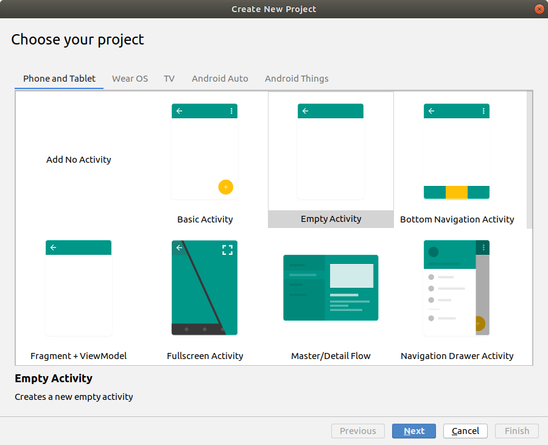{width=80%}

Choose *Empty Activity* from the *Phone and Tablet* tab, and click Next.

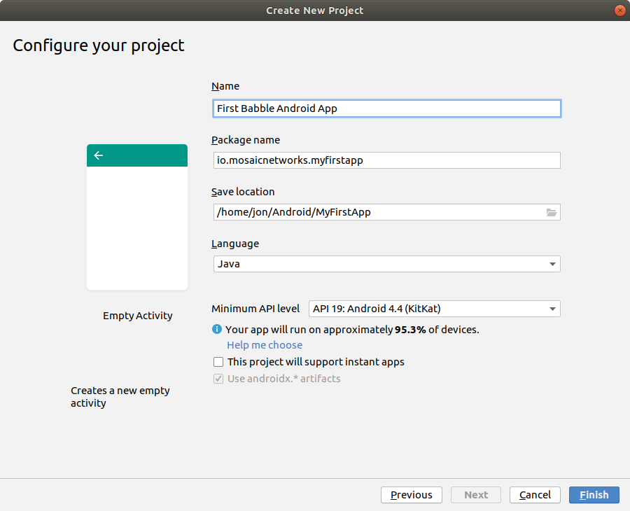{width=80%}

The options here should be self-explanatory. We would recommend not using spaces in the Package Name or the Save Location. Do not set the Minimum API Level below 19. Click Finish.


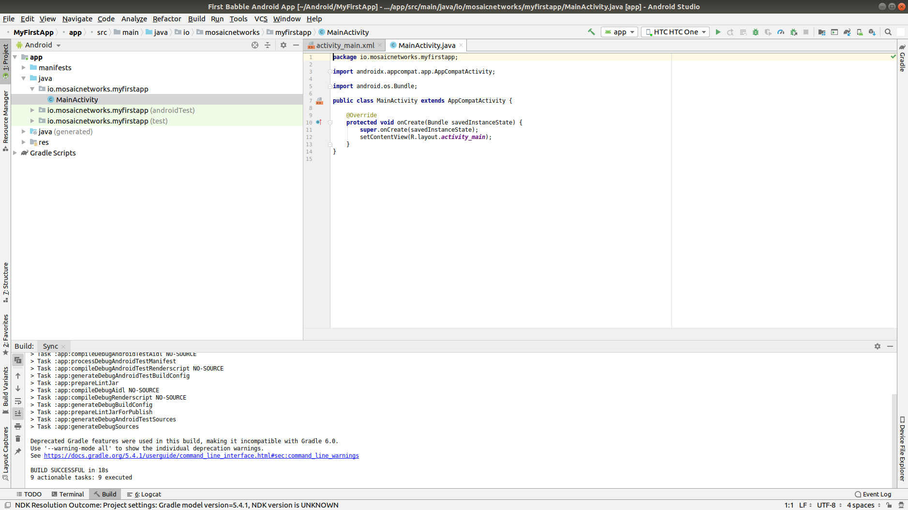

Android Studio will open, and after expanding some of the menus it will look something like above. 

*N.B. the screen will change a few seconds after opening when the initial gradle scripts complete. The status bar at the bottom of the window should tell you this is happening.*

<div style="page-break-after: always; visibility: hidden"> 
\pagebreak 
</div>

### Running the App

Connect your android device to your computer via a USB cable. First we will test that the Android Debug Bridge (**adb**) can see the device. 
```bash
jon@hpjon:~/Android/MyFirstApp$ adb devices
List of devices attached
4JPNU18709118621	device
jon@hpjon:~/Android/MyFirstApp$ 
```

The command ``adb kill-server`` will reset this connection. 

If you can see a device listed, go back to Android Studio. and in the top right is a target device dropdown. Select your device from the list. 

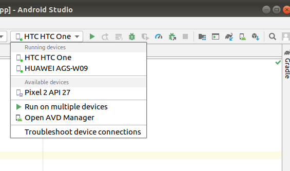

If you cannot find your device in the list, the ``Troubleshoot device connections`` option on that menu should help.

Then press that little green triangle to the right of the dropdown device menu. Gradle then builds the app, which is then installed onto the physical android device that you selected. The whole process tool about 20 seconds on my laptop (feel free to buy me a quicker one). 

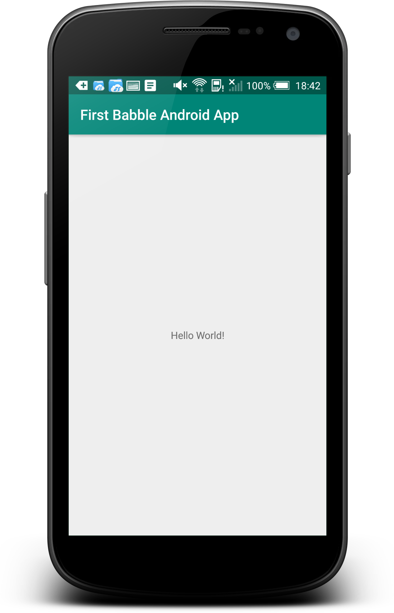{width=50%}

If you look on the device, you should find the app installed, as below:

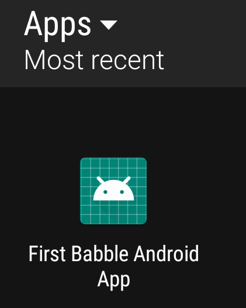{width=25%}

Congratulations, you have an app. Now onto Babble...

----

<div style="page-break-after: always; visibility: hidden"> 
\pagebreak 
</div>

## Our First Babble App 

We will now integrate the ``babble-android`` library into our skeleton app. We will use it to generate a key pair -- just to prove that we have a working library instance. 

### Integrating the Babble-Android Library

The library is hosted **jcenter**. To make it available, we need to amend some gradle scripts.

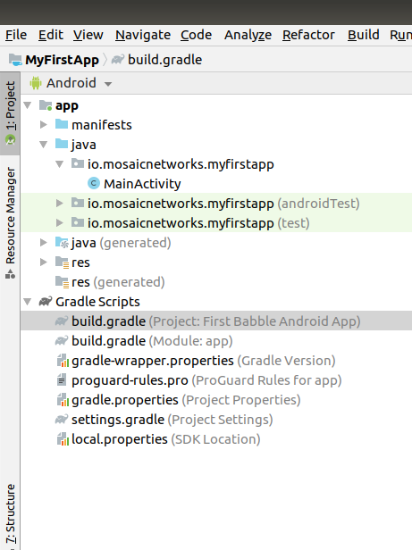{width=50%}

 In Android Studio, double click on the Project ``build.gradle`` as highlighted in the screenshot above. 
 
We then add the 3 line ``maven`` instruction as below:

```gradle 
allprojects {
    repositories {
        google()
        jcenter()
        maven {
            url 'https://dl.bintray.com/mosaicnetworks/maven'
        }
    }
} 
```

Which leaves the entire file looking like this:
 
```gradle
// Top-level build file where you can add configuration options common to all
// sub-projects/modules.

buildscript {
    repositories {
        google()
        jcenter()
        
    }
    dependencies {
        classpath 'com.android.tools.build:gradle:3.5.2'
        
        // NOTE: Do not place your application dependencies here; they belong
        // in the individual module build.gradle files
    }
}

allprojects {
    repositories {
        google()
        jcenter()
        maven {
            url 'https://dl.bintray.com/mosaicnetworks/maven'
        }
    }
}

task clean(type: Delete) {
    delete rootProject.buildDir
}
 
```

Next we need to amend the app ``build.gradle`` (it is below the Project ``build.gradle`` in the screenshot above. We add an implementation line to the bottom dependencies section.

```gradle
implementation 'io.mosaicnetworks:babble:0.1.0'
```

This leaves us with this full file:

```gradle
apply plugin: 'com.android.application'

android {
 compileSdkVersion 29
 buildToolsVersion "29.0.2"
 defaultConfig {
  applicationId "io.mosaicnetworks.myfirstapp"
  minSdkVersion 19
  targetSdkVersion 29
  versionCode 1
  versionName "1.0"
  testInstrumentationRunner "androidx.test.runner.AndroidJUnitRunner"
}
buildTypes {
 release {
 minifyEnabled false
 proguardFiles getDefaultProguardFile('proguard-android-optimize.txt'),
     'proguard-rules.pro'
  }
 }
}

dependencies {
  implementation fileTree(dir: 'libs', include: ['*.jar'])
  implementation 'io.mosaicnetworks:babble:0.1.0'
  implementation 'androidx.appcompat:appcompat:1.1.0'
  implementation 'androidx.constraintlayout:constraintlayout:1.1.3'
  testImplementation 'junit:junit:4.12'
  androidTestImplementation 'androidx.test.ext:junit:1.1.1'
  androidTestImplementation 'androidx.test.espresso:espresso-core:3.2.0'
}
```


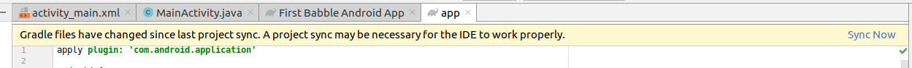

When you get a message like the above, click the ``Sync Now`` link on the right of the message.

### Using the Library

The library should now be included in the project. So lets use it! Open ``MainActivity.java`` as below:

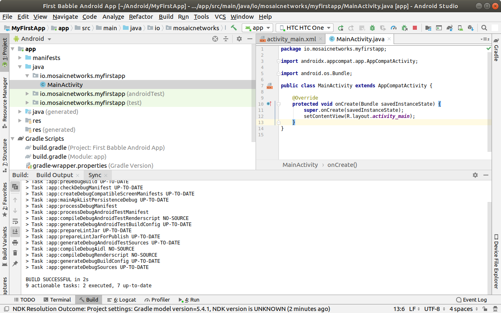

Add the lines below underneath the last import statement. The lines will appear greyed out, as the import is not yet used. As well as babble we are importing the ``Log`` package to write to the Android logs. 

```java
import io.mosaicnetworks.babble.node.KeyPair;
import android.util.Log;
```

Add the following lines as the last line of the ``onCreate`` function 
```java
KeyPair kp = new KeyPair();
Log.i("Yippee",kp.privateKey);
```

This code generates a key pair and writes the private code to the logs. 

Save all the files and run your app. 

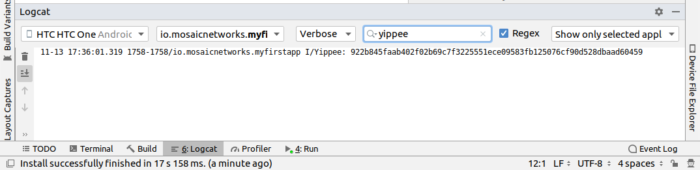

The app looks exactly as per the previous iteration, so lets take a look under the hood. Press logcat, as highlighted in gray in the screenshot above. Then type ``yippee`` in the search box at the top of that window to filter the logs. You should have a freshly generated private key in there. 


This project at this stage is available from github from [here](https://github.com/mosaicnetworks/babble-android-tutorial/tree/stage1) [^stage1]

[^stage1]: This code is the stage1 branch at https://github.com/mosaicnetworks/babble-android-tutorial/tree/stage1

The downloadable version of the project has mosaic network icons, rather than the default android ones. You can customise the icons using [Android Studio Image Asset Studio](https://developer.android.com/studio/write/image-asset-studio).[^imageasset] 

[^imageasset]: [Android Studio Image Asset Studio](https://developer.android.com/studio/write/image-asset-studio) is described here: https://developer.android.com/studio/write/image-asset-studio

----

<div style="page-break-after: always; visibility: hidden"> 
\pagebreak 
</div>

## Our First Babble Blockchain

Now we have access to the babble library from within our app, the next stage is to start a babble network. We will start with a single node. But before we can start babble we need to add some UI elements to allow us to interact with our babble node. 

Currently our application launches the activity ``MainActivity`` which calls the key pair generation code in it's ``onCreate`` method. 

In the Sample App [^sampleapp] that we are working towards, the MainActivity Screen presents the user with a choice of "**New**" or "**Join**". **New** starts a new babble network with your device as the sole peer. **Join** lets you specify the address of an existing network, pull down the configuration for that network and request to join it. 

As **New** is standalone functionality, and **Join** requires **New** be implemented to function, we will implement **New** first.

[^sampleapp]: The sample app is part of the ``babble-android`` library and is available from the [GitHub repo](https://github.com/mosaicnetworks/babble-android)

### Main Activity

First up we will amend ``MainActivity.java``. In the Android view it's layout should be under ``app/res/layout/activity_main.xml``. Double click on that file to open the XML layout file. It may also show a Preview:

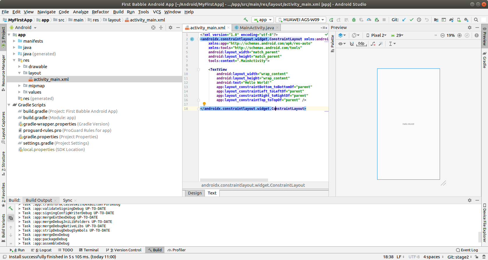

Delete the ``TextView`` tag. We have passed beyond the "Hello World!" stage. 

In the preview window. Click on ``Palette / Layouts / LinearLayout (vertical)`` and drag it onto the preview window. 

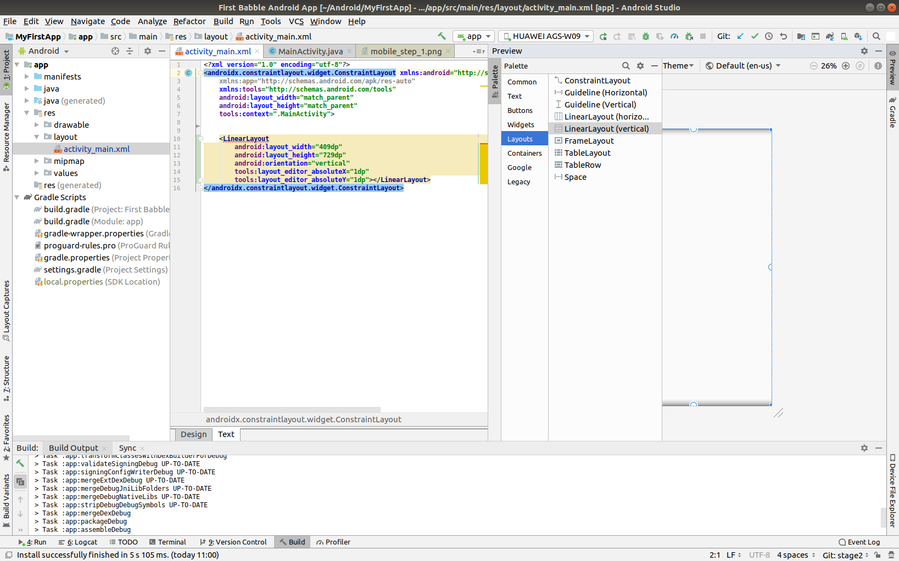

We will then set some properties for the LinearLayout. Amend it to look like this:

```xml
    <LinearLayout
        android:layout_width="0dp"
        android:layout_height="wrap_content"
        android:layout_marginStart="8dp"
        android:layout_marginLeft="8dp"
        android:layout_marginTop="8dp"
        android:layout_marginEnd="8dp"
        android:layout_marginRight="8dp"
        android:layout_marginBottom="8dp"
        android:orientation="vertical"
        app:layout_constraintBottom_toBottomOf="parent"
        app:layout_constraintEnd_toEndOf="parent"
        app:layout_constraintStart_toStartOf="parent"
        app:layout_constraintTop_toTopOf="parent">
        
        </LinearLayout>
```

The principal effect of theses changes are to set a margin so the buttons will not reach to the edge of the screen. Next we add a button by adding the following code between the opening and closing ``LinearLayout`` tags. 

```xml
    <Button
        android:id="@+id/button3"
        android:layout_width="match_parent"
        android:layout_height="wrap_content"
        android:onClick="newChat"
        android:text="@string/new_chat" />
```

Note that the onClick method is marked as an error as we have not created it yet, as is the caption. The preview should look as below:

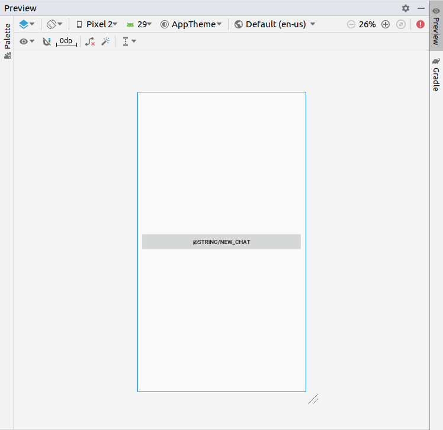{width=50%}

Update the ``strings.xml`` file found under ``app/res/values/strings.xml`` adding the line:

```xml
   <string name="new_chat">New</string>
```

to give:

```xml
<resources>
    <string name="app_name">First Babble Android App</string>
    <string name="new_chat">New</string>
</resources>
```
Save the file, and if you navigate back to the MainActivity preview, the text New should now appear on the button.

Open MainActivity.java (the java code, not the XML). 

Add the following code to the MainActivity class, under the onCreate method:

```java
    // called when the user presses the new chat button
    public void newChat(View view) {
        Log.i("Ki","newChat Called");
    }
```

Add the line below as the first line of the class, we will use this later to identified log messages from our app. :

```java
public class MainActivity extends AppCompatActivity {

    public static final String TAG = "FIRST-BABBLE-APP";
```


If the IDE does not add the line below, add it manually:

```java
import android.view.View;
``` 
The project should now build successfully. So build and run it. If you search for ``Ki`` in the logcat window --- exactly as you searched for ``Yippee`` before you should find results like below (if you have pressed the New button a few times...).


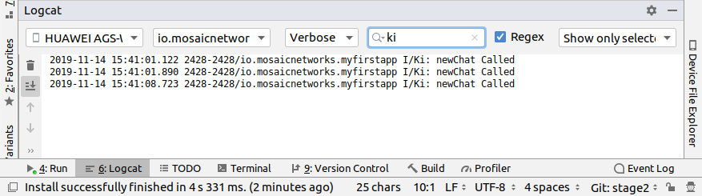

----

<div style="page-break-after: always; visibility: hidden"> 
\pagebreak 
</div>

## New Chat Activity

When we press the New button, we want to open a new screen where we can set some Chat Options. So lets create NewChatActivity.

Right click on MainActivity under the java tree. Select ``New > Activity > Basic Activity`` and enter the details as below:

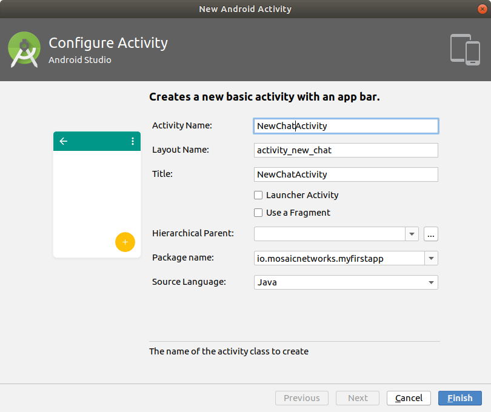


Edit MainActivity.java and amend the newChat function to read as follows:

```java
    // called when the user presses the new chat button
    public void newChat(View view) {
        Log.i("Ki","newChat Called");
        Intent intent = new Intent(this, NewChatActivity.class);
        startActivity(intent);
    }
```

If the IDE does not add the line below, add it manually:

```java
import android.content.Intent;
``` 

This change means pressing the button opens the NewChat Activity. The app will compile and run at this point. After pressing the button, you should get a screen that looks like this:

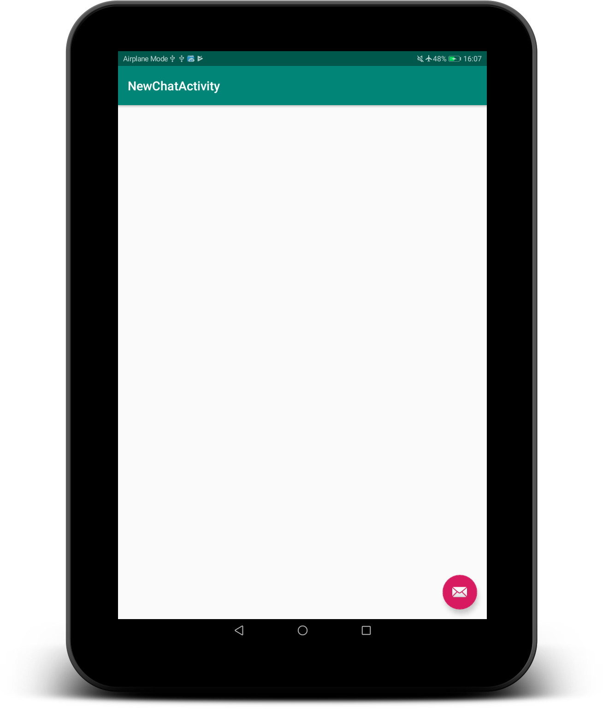

Update ``res/values/strings.xml`` to set the title_activity_new_chat to "New Chat"

```bash
<resources>
    <string name="app_name">First Babble Android App</string>
    <string name="new_chat">New</string>
    <string name="title_activity_new_chat">New Chat</string>
</resources>
```

### New Chat Activity Layout

Create new ``BasicActivity`` activity ``ChatActivity`` as per the NewChatActivity abov, using the values below:


In ``activity_new_chat.xml`` replace the whole file with the following code:

```xml
<?xml version="1.0" encoding="utf-8"?>
<androidx.constraintlayout.widget.ConstraintLayout 
    xmlns:android="http://schemas.android.com/apk/res/android"
    xmlns:app="http://schemas.android.com/apk/res-auto"
    xmlns:tools="http://schemas.android.com/tools"
    android:layout_width="match_parent"
    android:layout_height="match_parent"
    tools:context=".NewChatActivity">

    <LinearLayout
    android:layout_width="0dp"
    android:layout_height="wrap_content"
    android:layout_marginStart="8dp"
    android:layout_marginLeft="8dp"
    android:layout_marginTop="8dp"
    android:layout_marginEnd="8dp"
    android:layout_marginRight="8dp"
    android:layout_marginBottom="8dp"
    android:orientation="vertical"
    app:layout_constraintBottom_toBottomOf="parent"
    app:layout_constraintEnd_toEndOf="parent"
    app:layout_constraintStart_toStartOf="parent"
    app:layout_constraintTop_toTopOf="parent">

    <EditText
        android:id="@+id/editText"
        android:layout_width="match_parent"
        android:layout_height="wrap_content"
        android:ems="10"
        android:hint="@string/moniker"
        android:inputType="textPersonName" />

    <Button
        android:id="@+id/button"
        android:layout_width="match_parent"
        android:layout_height="wrap_content"
        android:onClick="startChat"
        android:text="@string/start" />
</LinearLayout>
    
</androidx.constraintlayout.widget.ConstraintLayout>
```

This adds and edit box to set the moniker for this node and a button to actually start the Chat.

You can delete ``content_new_chat.xml`` from the ``res/layout`` folder now as we have just removed the reference to it. 

In ``NewChatActivity.java`` replace the whole file with the code below: 
```java
package io.mosaicnetworks.myfirstapp;

import android.content.Intent;
import android.os.Bundle;


import androidx.annotation.StringRes;
import androidx.appcompat.app.AlertDialog;
import androidx.appcompat.app.AppCompatActivity;


import android.view.View;
import android.widget.EditText;

import java.util.ArrayList;

import io.mosaicnetworks.babble.discovery.Peer;

public class NewChatActivity extends AppCompatActivity {


    @Override
    protected void onCreate(Bundle savedInstanceState) {
        super.onCreate(savedInstanceState);
        setContentView(R.layout.activity_new_chat);
    }


    // called when the user presses the start chat button
    public void startChat(View view) {
        //get moniker
        EditText editText = findViewById(R.id.editText);
        String moniker = editText.getText().toString();
        if (moniker.isEmpty()) {
            displayOkAlertDialog(R.string.no_moniker_alert_title, 
    			R.string.no_moniker_alert_message);
            return;
        }

        MessagingService messagingService = MessagingService.getInstance();
        try {
            messagingService.configure(new ArrayList<Peer>(), moniker,
			Utils.getIPAddr(this));
        } catch (IllegalStateException ex) {
            //we tried to reconfigure before a leave completed
            displayOkAlertDialog(R.string.babble_busy_title, 
			R.string.babble_busy_message);
            return;
        }

        messagingService.start();
        Intent intent = new Intent(this, ChatActivity.class);
        intent.putExtra("MONIKER", moniker);
        startActivity(intent);
    }

    private void displayOkAlertDialog(@StringRes int titleId, 
    			@StringRes int messageId) {
        AlertDialog alertDialog = new AlertDialog.Builder(this)
                .setTitle(titleId)
                .setMessage(messageId)
                .setNeutralButton(R.string.ok_button, null)
                .create();
        alertDialog.show();
    }
}
```


### StateObserver.java

Copy the code below into a new file: ``StateObserver.java`` in the same folder as ``MainActivity.java``:

```java
package io.mosaicnetworks.myfirstapp;

public interface StateObserver {

    void onStateChanged(Message message);
}
```

This class provides an event handler for use in the MessagingService we are about to create...


### BabbleState.java

Copy the source below into place in the same folder as ``MainActivity.java``:

```java
package io.mosaicnetworks.myfirstapp;

import com.google.gson.JsonSyntaxException;

import java.nio.charset.Charset;
import java.nio.charset.StandardCharsets;
import java.security.MessageDigest;
import java.security.NoSuchAlgorithmException;

import io.mosaicnetworks.babble.node.TxConsumer;

public final class BabbleState implements TxConsumer {

    private static final MessageDigest mSha256Digest;
    private StateObserver mObserver;
    private byte[] mStateHash = "geneseis-state".getBytes();

    static {
        try {
            mSha256Digest = MessageDigest.getInstance("SHA-256");
        } catch (NoSuchAlgorithmException ex) {
            //  Every implementation of the Java platform is required to
            //  support the SHA-256 MessageDigest algorithm, so we 
            //  shouldn't get here!
            throw new RuntimeException(ex);
        }
    }

    public BabbleState(StateObserver observer) {
        mObserver = observer;
    }

    @Override
    public byte[] onReceiveTransactions(byte[][] transactions) {
        for (byte[] rawTx:transactions) {
            String tx = new String(rawTx, StandardCharsets.UTF_8);

            BabbleTx babbleTx;
            try {
                babbleTx = BabbleTx.fromJson(tx);
            } catch (JsonSyntaxException ex) {
                //skip any malformed transactions
                continue;
            }

            mObserver.onStateChanged(Message.fromBabbleTx(babbleTx));
            updateStateHash(tx);
        }

        return mStateHash;
    }

    private void updateStateHash(String tx) {
        mStateHash = hashFromTwoHashes(mStateHash, hash(tx));
    }

    private static byte[] hash(String tx) {
            return mSha256Digest.digest(tx.getBytes(Charset.forName("UTF-8")));
    }

    private static byte[] hashFromTwoHashes(byte[] a, byte[] b) {
            byte[] tempHash = new byte[a.length + b.length];
            System.arraycopy(a, 0, tempHash, 0, a.length);
            System.arraycopy(b, 0, tempHash, 0, b.length);
            return mSha256Digest.digest(tempHash);
    }
}


```


### BabbleTx.java

Copy the source below into place in the same folder as ``MainActivity.java``:

```java
package io.mosaicnetworks.myfirstapp;

import com.google.gson.Gson;
import com.google.gson.annotations.SerializedName;

public class BabbleTx {

    private final static Gson gson = new Gson();

    @SerializedName("from")
    public final String from;

    @SerializedName("text")
    public final String text;

    public BabbleTx(String from, String text) {
        this.from = from;
        this.text = text;
    }

    public static BabbleTx fromJson(String txJson) {
        return gson.fromJson(txJson, BabbleTx.class);
    }

    public byte[] toBytes() {
        return gson.toJson(this).getBytes();
    }
}


``` 


 
### Message.java

Copy the source below into place in the same folder as ``MainActivity.java``:

```java
package io.mosaicnetworks.myfirstapp;

import com.stfalcon.chatkit.commons.models.IMessage;
import com.stfalcon.chatkit.commons.models.IUser;

import java.util.Date;

public final class Message implements IMessage {

    public final static class Author implements IUser {

        private final String mName;

        public Author(String name) {
            mName = name;
        }

        @Override
        public String getId() {
            return mName;
        }

        @Override
        public String getName() {
            return mName;
        }

        @Override
        public String getAvatar() {
            return null;
        }
    }

    private final String mText;
    private final String mAuthor;
    private final Date mDate;

    public Message(String text, String author) {
        mText = text;
        mAuthor = author;
        mDate = new Date();
    }

    public static Message fromBabbleTx(BabbleTx babbleTx) {
        return new Message(babbleTx.text, babbleTx.from);
    }

    public BabbleTx toBabbleTx() {
        return new BabbleTx(mAuthor, mText);
    }

    @Override
    public String getId() {
        return mAuthor;
    }

    @Override
    public String getText() {
        return mText;
    }

    @Override
    public Author getUser() {
        return new Author(mAuthor);
    }

    @Override
    public Date getCreatedAt() {
        return mDate;
    }
}

```

You will note the section below introduces an external dependency: 

```java
import com.stfalcon.chatkit.commons.models.IMessage;
import com.stfalcon.chatkit.commons.models.IUser;
```

Add the lines below to the app ``build.gradle`` file dependencies section, and click Sync Now on the pop up bar: 

```
    implementation 'com.google.code.gson:gson:2.8.5'
    implementation 'com.github.stfalcon:chatkit:0.3.3'
```


 
### MessageObserver.java

Copy the source below into place in the same folder as ``MainActivity.java``:

```java
package io.mosaicnetworks.myfirstapp;

public interface MessageObserver {

    void onMessageReceived(Message message);
}

```

### Utils.java
Copy the source below into place in the same folder as ``MainActivity.java``:

```java
package io.mosaicnetworks.myfirstapp;

import android.content.Context;
import android.net.wifi.WifiManager;
import android.text.format.Formatter;
import android.util.Log;

import static android.content.Context.WIFI_SERVICE;

public class Utils {

    public static String getIPAddr(Context context) {
        WifiManager wm = (WifiManager) 
                context.getApplicationContext().getSystemService(WIFI_SERVICE);
        String ip = 
                Formatter.formatIpAddress(wm.getConnectionInfo().getIpAddress());
        Log.d("getIPAddr", "Got IP address: " + ip);
        return ip;
    }
}
```


### MessagingService.java

Copy the source below into place in the same folder as ``MainActivity.java``:

```java
package io.mosaicnetworks.myfirstapp;

import java.io.IOException;
import java.util.ArrayList;
import java.util.List;

import io.mosaicnetworks.babble.discovery.HttpPeerDiscoveryServer;
import io.mosaicnetworks.babble.discovery.Peer;
import io.mosaicnetworks.babble.node.BabbleConfig;
import io.mosaicnetworks.babble.node.BabbleNode;
import io.mosaicnetworks.babble.node.KeyPair;
import io.mosaicnetworks.babble.node.LeaveResponseListener;

public class MessagingService {

    public enum State {
        UNCONFIGURED,
        CONFIGURED,
        RUNNING,
        RUNNING_WITH_DISCOVERY
    }

    private static MessagingService instance;
    private List<MessageObserver> mObservers = new ArrayList<>();
    private BabbleState mBabbleState;
    private BabbleNode mBabbleNode;
    private HttpPeerDiscoveryServer mHttpPeerDiscoveryServer;
    private KeyPair mKeyPair = new KeyPair();
    private static final int BABBLING_PORT = 6666;
    public static final int DISCOVERY_PORT = 8988;
    private State mState = State.UNCONFIGURED;

    public static MessagingService getInstance() {
        if (instance==null) {
            instance = new MessagingService();
        }
        return instance;
    }

    public void configure(List<Peer> peers, String moniker, String inetAddress) {

        if (mState==State.RUNNING || 
			mState ==State.RUNNING_WITH_DISCOVERY) {
            throw new IllegalStateException(
            		"Cannot configure while the service is running");
        }

        mBabbleState = new BabbleState(new StateObserver() {
            @Override
            public void onStateChanged(Message message) {
                notifyObservers(message);
            }
        });

        // If peers list is empty we need to setup a new babble group, this 
        // requires a peers list which contains this node
        if (peers.isEmpty()) {
            peers.add(new Peer(mKeyPair.publicKey, inetAddress + 
            		":" + BABBLING_PORT, moniker));
        }

        try {
            mBabbleNode = BabbleNode.createWithConfig(peers, 
                    mKeyPair.privateKey, inetAddress,
                    BABBLING_PORT, moniker, mBabbleState,
                    new BabbleConfig.Builder().logLevel(
                            BabbleConfig.LogLevel.DEBUG).build());
            mState = State.CONFIGURED;
        } catch (IllegalArgumentException ex) {
            // The reassignment of mState and mBabbleNode has failed, so
            // leave them as before
            //TODO: need to catch port in use exception (IOException)
            // and throw others
            throw new RuntimeException(ex);
        }

        mHttpPeerDiscoveryServer = new HttpPeerDiscoveryServer(inetAddress,
               DISCOVERY_PORT, mBabbleNode);
    }

    public void start() {
        if (mState==State.UNCONFIGURED || mState==State.RUNNING ||
                mState==State.RUNNING_WITH_DISCOVERY) {
            throw new IllegalStateException(
                          "Cannot start an unconfigured or running service");
        }

        mBabbleNode.run();
        mState=State.RUNNING;

        try {
            mHttpPeerDiscoveryServer.start();
            mState=State.RUNNING_WITH_DISCOVERY;
        } catch (IOException ex) {
            // Probably the port is in use, we'll continue without the
            // discovery service
        }
    }

    public void stop() {
        if (!(mState==State.RUNNING || mState==State.RUNNING_WITH_DISCOVERY)) {
            throw new IllegalStateException(
                    "Cannot stop a service which isn't running");
        }

        mHttpPeerDiscoveryServer.stop();
        mHttpPeerDiscoveryServer=null;

        mBabbleNode.leave(new LeaveResponseListener() {
            @Override
            public void onSuccess() {
                mBabbleNode=null;
                mState = State.UNCONFIGURED;
            }
        });
    }

    public void submitMessage(Message message) {
        if (!(mState==State.RUNNING || mState==State.RUNNING_WITH_DISCOVERY)) {
            throw new IllegalStateException(
                    "Cannot submit when the service isn't running");
        }
        mBabbleNode.submitTx(message.toBabbleTx().toBytes());
    }

    public State getState() {
        return mState;
    }

    public void registerObserver(MessageObserver messageObserver) {
        if (!mObservers.contains(messageObserver)) {
            mObservers.add(messageObserver);
        }
    }

    public void removeObserver(MessageObserver messageObserver) {
        mObservers.remove(messageObserver);
    }

    private void notifyObservers(Message message) {
        for (MessageObserver observer: mObservers) {
            observer.onMessageReceived(message);
        }
    }
}

```

### strings.xml

We need to the add the following to ``res/values/strings.xml`` as they are used in the code changes above.
```xml
    <string name="moniker">Moniker</string>
    <string name="start">Start</string>
    <string name="no_moniker_alert_title">No moniker</string>
    <string name="no_moniker_alert_message">Please enter a moniker!</string>
    <string name="ok_button">OK</string>
    <string name="babble_busy_title">Babble node busy</string>
    <string name="babble_busy_message">Please try again in a few seconds!</string>
```

### Running Babble

And finally after all of that cut and paste, we have a working instance of babble --- albeit with at least one major drawback --- it has no UI and no way to access it. 

If you start the app through Android Studio, and look at the logcat output (filtered to just our app), after pressing the New button, entering a Moniker and pressing the Join button, you should see something like below:


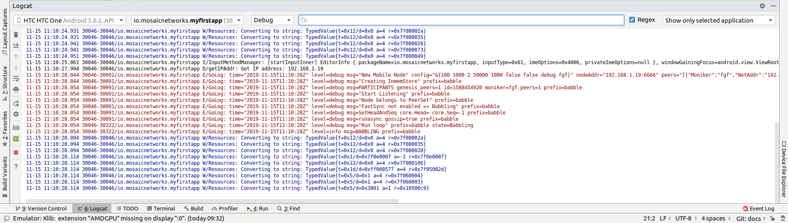


## Some Explanations

We have just added a lot of code, which is all co-dependent. Now we have a babble invocation in place, we can pause to explain what just happened there. 

Within the ``NewChatActivity.java`` button click handler the contents of the edit box are processed into ``mMoniker`` and the function ``joinChat()`` is called. 

Within ``joinChat()`` are the 2 key lines:

```java
        mMessagingService.configure(new ArrayList<Peer>(), 
                  mMoniker, Utils.getIPAddr(this));
        mMessagingService.start();
```

They invoke the singleton instance of the ``MessagingService`` class. The MessagingService class is a simplified version of the code from the sample app included in the babble-android repo. 

At a high level, it configures, then starts a babble node.

Delving a little deeper, the configure method takes a peers list, the moniker and IP for this node. In our initial use case, the peers list will always be empty as we can only create new networks at the moment. 


//TODO Expand this explanation section?


This project at this stage is available from github from [here](https://github.com/mosaicnetworks/babble-android-tutorial/tree/stage2) [^stage2]

[^stage2]: This code is the stage2 branch at https://github.com/mosaicnetworks/babble-android-tutorial/tree/stage2

----

## Interacting with Babble

The next stage is to make Babble usable. To do that we need to work on the ``ChatActivity`` so it sends and receives messages from Babble. 

First up we need a UI. We are going to use [ChatKit](https://github.com/stfalcon-studio/ChatKit) rather than reinvent the wheel. 

### build.gradle (app)

We need to add this library to the app ``build.gradle`` file by adding the following line: 

```
    implementation 'com.github.stfalcon:chatkit:0.3.3'
``` 

### activity_chat.xml

We can then add the layout to ``res/layout/activity_chat.xml`` --- replace all the contents with the code below:

```xml
<?xml version="1.0" encoding="utf-8"?>
<RelativeLayout
    xmlns:android="http://schemas.android.com/apk/res/android"
    xmlns:app="http://schemas.android.com/apk/res-auto"
    xmlns:tools="http://schemas.android.com/tools"
    android:layout_width="match_parent"
    android:layout_height="match_parent"
    android:background="@color/white"
    tools:context=".ChatActivity">

    <com.stfalcon.chatkit.messages.MessagesList
        android:id="@+id/messagesList"
        android:layout_width="match_parent"
        android:layout_height="match_parent"
        android:layout_above="@+id/input"/>

    <View
        android:layout_width="match_parent"
        android:layout_height="1dp"
        android:layout_above="@+id/input"
        android:layout_marginLeft="16dp"
        android:layout_marginRight="16dp"
        android:background="@color/gray_light"/>

    <com.stfalcon.chatkit.messages.MessageInput
        android:id="@+id/input"
        android:layout_width="match_parent"
        android:layout_height="wrap_content"
        android:layout_alignParentBottom="true"
        app:inputHint="@string/hint_enter_a_message"
        app:showAttachmentButton="true"/>

</RelativeLayout>
```

The layout here is a fairly standard chat layout a message entry section at the bottom of the screen and a message display above it.

### colors.xml

We need to the add the following to ``res/values/colors.xml`` as it is used in the code changes above.

```xml
    <color name="gray_light">#e8e8e8</color>    
```

### ChatActivity.java

Replace all of the file ``ChatActivity.java`` with the code below:

```java
package io.mosaicnetworks.myfirstapp;

import android.os.Bundle;
import androidx.appcompat.app.AppCompatActivity;
import android.content.Intent;
import android.widget.Toast;
import com.stfalcon.chatkit.messages.MessageInput;
import com.stfalcon.chatkit.messages.MessagesList;
import com.stfalcon.chatkit.messages.MessagesListAdapter;

public class ChatActivity extends AppCompatActivity implements MessageObserver {

    private MessagesListAdapter<Message> mAdapter;
    private String mMoniker;
    private final MessagingService mMessagingService = MessagingService.getInstance();

    @Override
    protected void onCreate(Bundle savedInstanceState) {
        super.onCreate(savedInstanceState);
        setContentView(R.layout.activity_chat);

        Intent intent = getIntent();
        mMoniker = intent.getStringExtra("MONIKER");

        initialiseAdapter();
        mMessagingService.registerObserver(this);

        if (mMessagingService.getState()!=
                      MessagingService.State.RUNNING_WITH_DISCOVERY) {
            Toast.makeText(this, "Unable to advertise peers",
                      Toast.LENGTH_LONG).show();
        }
    }

    private void initialiseAdapter() {
        MessagesList mMessagesList = findViewById(R.id.messagesList);

        mAdapter = new MessagesListAdapter<>(mMoniker, null);
        mMessagesList.setAdapter(mAdapter);

        MessageInput input = findViewById(R.id.input);

        input.setInputListener(new MessageInput.InputListener() {
            @Override
            public boolean onSubmit(CharSequence input) {
                mMessagingService.submitMessage(
                            new Message(input.toString(), mMoniker));
                return true;
            }
        });
    }

    @Override
    public void onMessageReceived(final Message message) {
        runOnUiThread(new Runnable() {
            @Override
            public void run() {
                mAdapter.addToStart(message, true);
            }
        });
    };

    @Override
    public void onBackPressed() {
        mMessagingService.stop();
        super.onBackPressed();
    }

    @Override
    protected void onDestroy() {
        mMessagingService.removeObserver(this);

        super.onDestroy();
    }
}
```

### strings.xml

We need to the add the following to ``res/values/strings.xml`` as they are used in the code changes above.
```xml
    <string name="hint_enter_a_message">Enter a message</string>
    
```

### Build, Run and Test 

Build you app and run it. You should now be able to start a chat with yourself and send messages to yourself as below:

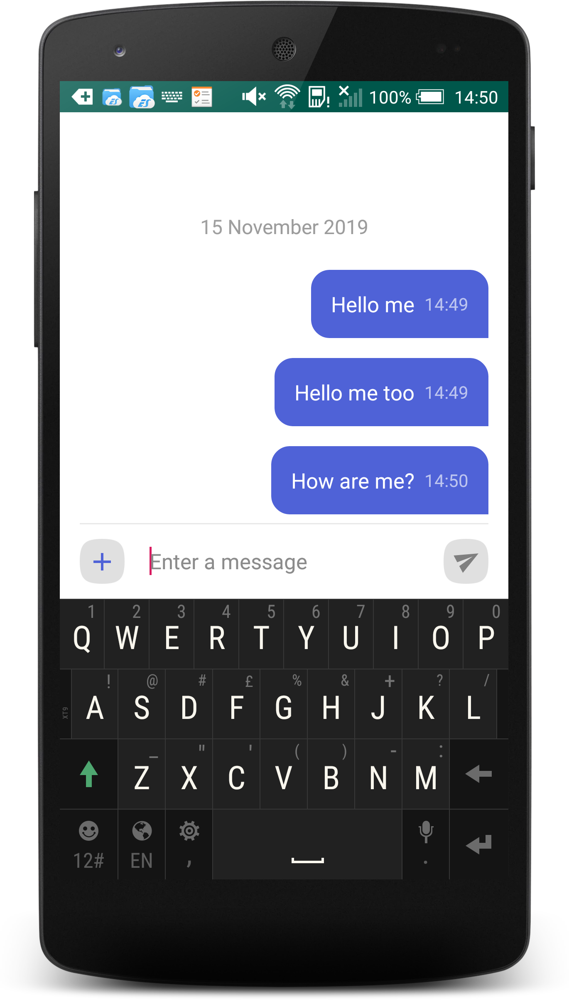{width=50%}

This project at this stage is available from github from [here](https://github.com/mosaicnetworks/babble-android-tutorial/tree/stage3) [^stage3]

[^stage3]: This code is the stage3 branch at https://github.com/mosaicnetworks/babble-android-tutorial/tree/stage3


# Release Checklist:

+ Search for //TODO and make sure all are excised
+ Delete this section


