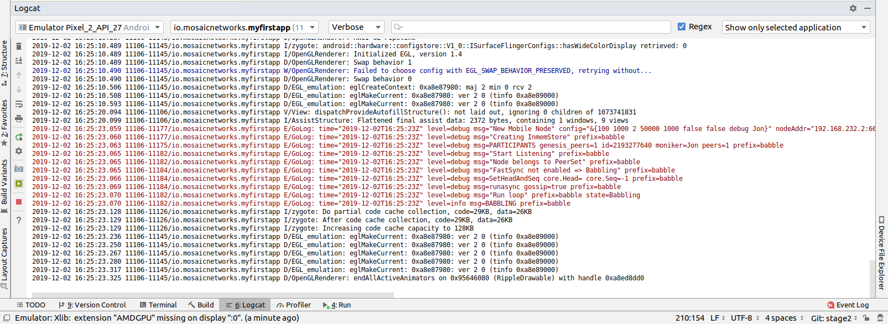
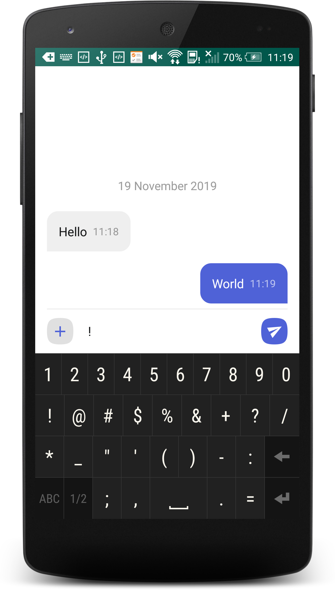
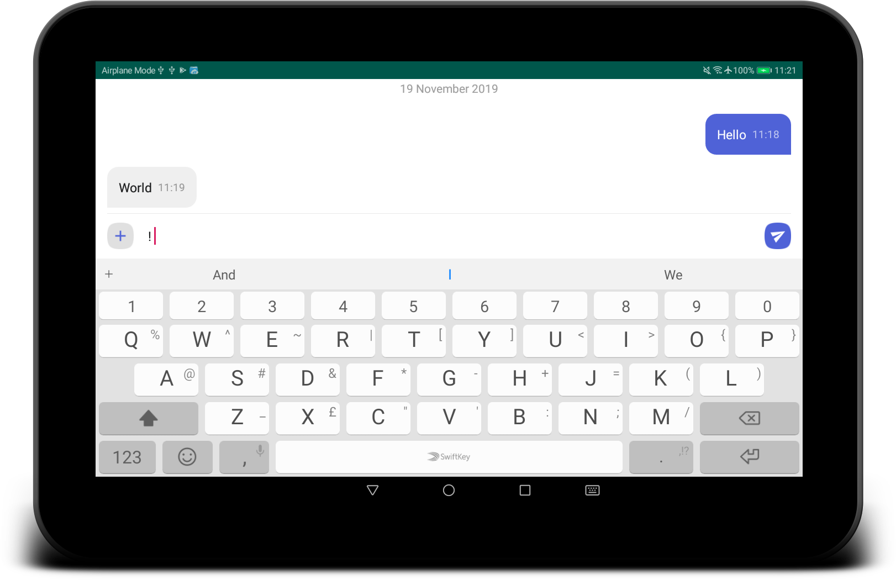

# My First Babble App Tutorial

This article is a walkthrough of the process of building your first Android App using the ``babble-android`` library. We are working towards the Sample App included in the ``babble-android`` library[^sampleapp].

## Babble

Babble enables multiple computers to behave as one. It uses Peer to Peer (P2P) networking and a consensus algorithm to guarantee that a group of connected computers process the same commands in the same order; a technique known as state-machine replication. This makes for secure systems that can tolerate arbitrary failures, including malicious behaviour.

We use an adaptation of the Hashgraph consensus algorithm, invented by Leemon
Baird. Hashgraph is best described in the
[white-paper](http://www.swirlds.com/downloads/SWIRLDS-TR-2016-01.pdf) and its
[accompanying document](http://www.swirlds.com/downloads/SWIRLDS-TR-2016-02.pdf).
The original algorithm is protected by [patents](http://www.swirlds.com/ip/) in
the USA. Therefore, anyone intending to use this software in the USA should
obtain a license from the patent holders.

Hashgraph is based on the intuitive idea that gossiping about gossip itself
yields enough information to compute a consensus ordering of events. It attains
the theoretical limit of tolerating up to one-third of faulty nodes without
compromising on speed. For those familiar with the jargon, it is a leaderless,
asynchronous BFT consensus algorithm.

Babble projects the output of the consensus algorithm onto a linear blockchain
which is more suitable for representing an ordered list of transactions and
facilitates the creation of light-clients. For information about this projection
please refer to [documentation](http://docs.babble.io/en/latest/blockchain.html)
pages.

This blockchain mapping is also instrumental in two important features that were
alluded to in Baird's paper, but not implemented:

- A [fast-sync](http://docs.babble.io/en/latest/fastsync.html) protocol which
  enables nodes to join a cluster without having to download the entire history
  of gossip.

- A [dynamic membership](http://docs.babble.io/en/latest/dynamic_membership.html)
  protocol, which enables peers to join or leave a cluster on demand.

### Design

Babble is designed to integrate with applications written in any programming
language.

#### Overview


Almost any software application can be modelled in terms of a *service* and a
*state*. The *service* is responsible for processing commands (ex. user input),
while the *state* is responsible for manipulating and storing the data (eg.
database). Usually, when commands need to update the data, the *service* will
invoke the *state* directly. In a distributed application, however, commands
(referred to as *transactions* in this context), must be broadcast to all
replicas and consistently ordered before being applied to the *state*. This
ensures that all replicas process the same commands in the same order. Hence,
the *service* no longer communicates directly with the *state* (except for
read-only requests), but forwards commands to a *transaction ordering system*
which takes care of broadcasting and ordering the transactions across all
replicas before feeding them back to the application's *state*.

Babble is an ordering system that plugs into any application thanks to a very
simple interface. It uses a consensus algorithm, to replicate and order the
transactions, and a blockchain to represent the resulting list. A blockchain is
a linear data structure composed of batches of transactions, hashed and signed
together, easily allowing to verify any transaction. So, instead of applying
commands directly to the *state*, Babble applications must forward the commands
to Babble and let them be processed asynchronously by the consensus system
before receiving them back, in blocks, ready to be applied to the *state*.

Note that it is left to the application layer to filter out bad transactions 
before relaying them from clients to the consensus engine. Unlike other 
middleware designed to sit in front of the application (like Apache or 
Tendermint), the user-facing API is app-specific, and Babble just takes care or
managing the consensus "under the hood". This filtering partially addresses spam
from anonymous clients, but doesn't protect against malicious nodes spamming the
network; that is a potential enhancement on the roadmap.  

#### API

Babble communicates with the App through an `AppProxy` interface, which has two
implementations:

- `SocketProxy`: A SocketProxy connects to an App via TCP sockets. It enables
                 the application to run in a separate process or machine, and to
                 be written in any programming language.

- `InmemProxy` : An InmemProxy uses native callback handlers to integrate Babble
                 as a regular Go dependency.

The `AppProxy` interface exposes three methods for Babble to call the App:

- `CommitBlock(Block) (CommitResponse, error)`: Commits a block to the
        application and returns the resulting state-hash, with accepted internal
        transactions.
- `GetSnapshot(int) ([]byte, error)`: Gets the application snapshot
        corresponding to a particular block index.
- `Restore([]byte) error`: Restores the App state from a snapshot.

Reciprocally, `AppProxy` relays transactions from the App to Babble via a native
Go channel - `SubmitCh` - which ties into the application differently depending
on the type of proxy (Socket or Inmem).

Babble asynchronously processes transactions and eventually feeds them back to
the App, in consensus order and bundled into blocks, with a **CommitBlock**
call. Transactions are just raw bytes and Babble does not need to know what they
represent. Therefore, encoding and decoding transactions is done by the App.


<div style="page-break-after: always; visibility: hidden"> 
\pagebreak 
</div>

## Prerequisites

We will assume that you have installed Android Studio, an Android SDK with API version 29 and Android NDK. Android API 29 (10.0 / Q) is assumed, if use a previous version the create activity items in these instructions will use AppCompat instead of AndroidX[^androidx], leading to incompatibilities with the pasted source code. The babble node itself is compatible with AppCompat, but converting the sample to use AppCompat is beyond the scope of this article.

This tutorial is going to assume deployment to a physical Android device. Thus you will need an Android device (minimum API version 19[^androiddevice]) with the developer options turned on, debugging enabled, and a suitable USB cable. You could use the android emulator, but that is beyond the scope of this article.


[^androidx]: You can read more about AndroidX here: [https://android-developers.googleblog.com/2018/05/hello-world-androidx.html](https://android-developers.googleblog.com/2018/05/hello-world-androidx.html) 

[^androiddevice]: API version 19 is Android 4.4 (KitKat). In May 3.8% of devices were using version 18 or lower. Android 4.4 was released in 2013. Whilst it would be possible to code support for earlier versions, the existing code uses Android features introduced in Android 4.4.

<div style="page-break-after: always; visibility: hidden"> 
\pagebreak 
</div>
## Our First Minimal App

First up we will create a minimal app to test our environment and prove that we have loaded the ``babble-android`` library correctly. Fire up Android Studio and select ``File/New Project``. You are asked to choose a project template.

{width=80%}

Choose *Empty Activity* from the *Phone and Tablet* tab, and click Next.

{width=60%}

The options here should be self-explanatory. We would recommend not using spaces in the Package Name or the Save Location. Do not set the Minimum API Level below 19. Click Finish.


Android Studio will open, and after expanding some of the menus it will look something like above. 

*N.B. the screen will change a few seconds after opening when the initial gradle scripts complete. The status bar at the bottom of the window should tell you this is happening.*

<div style="page-break-after: always; visibility: hidden"> 
\pagebreak 
</div>

### Running the App

Connect your android device to your computer via a USB cable. First we will test that the Android Debug Bridge (**adb**) can see the device. 
```bash
jon@hpjon:~/Android/MyFirstApp$ adb devices
List of devices attached
4JPNU18709118621	device
jon@hpjon:~/Android/MyFirstApp$ 
```

The command ``adb kill-server`` will reset this connection. 

If you can see a device listed, go back to Android Studio. and in the top right is a target device dropdown. Select your device from the list. 


If you cannot find your device in the list, the ``Troubleshoot device connections`` option on that menu should help.

Then press that little green triangle to the right of the dropdown device menu. Gradle then builds the app, which is then installed onto the physical android device that you selected. The whole process tool about 20 seconds on my laptop (feel free to buy me a quicker one). 

{width=50%} {width=25%}


If you look on the device, you should find the app installed, as on the right above.


Congratulations, you have an app. Now onto Babble...

----

<div style="page-break-after: always; visibility: hidden"> 
\pagebreak 
</div>

## Our First Babble App 

We will now integrate the ``babble-android`` library into our skeleton app. We will use it to generate a key pair -- just to prove that we have a working library instance. 

### Integrating the Babble-Android Library

The library is hosted **jcenter**. To make it available, we need to amend some gradle scripts.

{width=50%}

 In Android Studio, double click on the Project ``build.gradle`` as highlighted in the screenshot above. 
 
We then add the 3 line ``maven`` instruction as below:

```gradle 
allprojects {
    repositories {
        google()
        jcenter()
        maven {
            url 'https://dl.bintray.com/mosaicnetworks/maven'
        }
    }
} 
```

Which leaves the entire file looking like this:
 
```gradle
// Top-level build file where you can add configuration options common to all
// sub-projects/modules.

buildscript {
    repositories {
        google()
        jcenter()
        
    }
    dependencies {
        classpath 'com.android.tools.build:gradle:3.5.2'
        
        // NOTE: Do not place your application dependencies here; they belong
        // in the individual module build.gradle files
    }
}

allprojects {
    repositories {
        google()
        jcenter()
        maven {
            url 'https://dl.bintray.com/mosaicnetworks/maven'
        }
    }
}

task clean(type: Delete) {
    delete rootProject.buildDir
}
 
```

Next we need to amend the app ``build.gradle`` (it is below the Project ``build.gradle`` in the screenshot above. We add an implementation line to the bottom dependencies section.

```gradle
implementation 'io.mosaicnetworks:babble:0.1.0'
```

This leaves us with this full file:

```gradle
apply plugin: 'com.android.application'

android {
 compileSdkVersion 29
 buildToolsVersion "29.0.2"
 defaultConfig {
  applicationId "io.mosaicnetworks.myfirstapp"
  minSdkVersion 19
  targetSdkVersion 29
  versionCode 1
  versionName "1.0"
  testInstrumentationRunner "androidx.test.runner.AndroidJUnitRunner"
}
buildTypes {
 release {
 minifyEnabled false
 proguardFiles getDefaultProguardFile('proguard-android-optimize.txt'),
     'proguard-rules.pro'
  }
 }
}

dependencies {
  implementation fileTree(dir: 'libs', include: ['*.jar'])
  implementation 'io.mosaicnetworks:babble:0.2.1'
  implementation 'androidx.appcompat:appcompat:1.1.0'
  implementation 'androidx.constraintlayout:constraintlayout:1.1.3'
  testImplementation 'junit:junit:4.12'
  androidTestImplementation 'androidx.test.ext:junit:1.1.1'
  androidTestImplementation 'androidx.test.espresso:espresso-core:3.2.0'
}
```


When you get a message like the above, click the ``Sync Now`` link on the right of the message.

### Using the Library

The library should now be included in the project. So lets use it! Open ``MainActivity.java`` as below:


Add the lines below underneath the last import statement. The lines will appear greyed out, as the import is not yet used. As well as babble we are importing the ``Log`` package to write to the Android logs. 

```java
import io.mosaicnetworks.babble.node.KeyPair;
import android.util.Log;
```

Add the following lines as the last line of the ``onCreate`` function 
```java
KeyPair kp = new KeyPair();
Log.i("Yippee",kp.privateKey);
```

This code generates a key pair and writes the private code to the logs. 

Save all the files and run your app. 


The app looks exactly as per the previous iteration, so lets take a look under the hood. Press logcat, as highlighted in gray in the screenshot above. Then type ``yippee`` in the search box at the top of that window to filter the logs. You should have a freshly generated private key in there. 


This project at this stage is available from github from [here](https://github.com/mosaicnetworks/babble-android-tutorial/tree/stage1) [^stage1]

[^stage1]: This code is the stage1 branch at https://github.com/mosaicnetworks/babble-android-tutorial/tree/stage1

The downloadable version of the project has mosaic network icons, rather than the default android ones. You can customise the icons using [Android Studio Image Asset Studio](https://developer.android.com/studio/write/image-asset-studio).[^imageasset] 

[^imageasset]: [Android Studio Image Asset Studio](https://developer.android.com/studio/write/image-asset-studio) is described here: https://developer.android.com/studio/write/image-asset-studio

----

<div style="page-break-after: always; visibility: hidden"> 
\pagebreak 
</div>

## Our First Babble Blockchain

Now we have access to the babble library from within our app, the next stage is to start a babble network. We will start with a single node. But before we can start babble we need to add some UI elements to allow us to interact with our babble node. 

Currently our application launches the activity ``MainActivity`` which calls the key pair generation code in it's ``onCreate`` method. 

In the Sample App [^sampleapp] that we are working towards, the MainActivity Screen presents the user with a choice of "**New**" or "**Join**". **New** starts a new babble network with your device as the sole peer. **Join** lets you specify the address of an existing network, pull down the configuration for that network and request to join it. 

As **New** is standalone functionality, and **Join** requires **New** be implemented to function, we will implement **New** first.

[^sampleapp]: The sample app is part of the ``babble-android`` library and is available from the [GitHub repo](https://github.com/mosaicnetworks/babble-android)

### Main Activity

First up we will amend ``MainActivity.java``. replace all of the code with the following:

```java
package io.mosaicnetworks.myfirstapp;

import androidx.appcompat.app.AppCompatActivity;

import android.content.Intent;
import android.os.Bundle;

import io.mosaicnetworks.babble.node.KeyPair;


import io.mosaicnetworks.babble.configure.BaseConfigActivity;
import io.mosaicnetworks.babble.node.BabbleService;


import android.util.Log;

public class MainActivity extends BaseConfigActivity {
    
    @Override
    public BabbleService getBabbleService() {
        return MessagingService.getInstance();
    }

    @Override
    public void onJoined(String moniker) {
        // DO nothing for now  
    }

    @Override
    public void onStartedNew(String moniker) {
        Intent intent = new Intent(this, ChatActivity.class);
        intent.putExtra("MONIKER", moniker);
        startActivity(intent);
    }
    
}

```

We have removed our key generation in the onCreate method. Instead
``MainActivity`` now extends ``BaseConfigActivity``. The ``BaseConfigActivity``
provides screens to create **New** and to **Join** networks. We just need to
define the callback event handlers for each case. The further processing is
identical in both cases - both result in your babble node being started and
in a babble network -- the only difference is the number of nodes. 

If you want more control over the network joining screens, the branches with
0.2.1 suffices in the github repo have a worked version using activities
external to the ``babble-android`` library. 


Add the line below as the first line of the class, we will use this later to identified log messages from our app. :

```java
public class MainActivity extends AppCompatActivity {

    public static final String TAG = "FIRST-BABBLE-APP";
```

----

<div style="page-break-after: always; visibility: hidden"> 
\pagebreak 
</div>


### AppState.java

Copy the source below into place in the same folder as ``MainActivity.java``:

```java
package io.mosaicnetworks.myfirstapp;

import com.google.gson.JsonSyntaxException;

import java.nio.charset.StandardCharsets;
import java.util.ArrayList;
import java.util.HashMap;
import java.util.List;
import java.util.Map;

import io.mosaicnetworks.babble.node.BabbleState;

public class AppState implements BabbleState {

    private byte[] mStateHash = new byte[0];
    private final Map<Integer, BabbleTx> mState = new HashMap<>();
    private Integer mNextIndex = 0;

    @Override
    public byte[] applyTransactions(byte[][] transactions) {
        for (byte[] rawTx:transactions) {
            String tx = new String(rawTx, StandardCharsets.UTF_8);

            BabbleTx babbleTx;
            try {
                babbleTx = BabbleTx.fromJson(tx);
            } catch (JsonSyntaxException ex) {
                //skip any malformed transactions
                continue;
            }

            mState.put(mNextIndex, babbleTx);
            mNextIndex++;
        }

        updateStateHash();
        return mStateHash;
    }

    @Override
    public void reset() {
        mState.clear();
        mNextIndex = 0;
    }

    public List<Message> getMessagesFromIndex(Integer index) {

        if (index<0) {
            throw new IllegalArgumentException("Index cannot be less than 0");
        }

        if (index >= mNextIndex) {
            return new ArrayList<>();
        }

        Integer numMessages = mNextIndex - index;

        List<Message> messages = new ArrayList<>(numMessages);

        for (int i = 0; i < numMessages; i++) {
            messages.add(Message.fromBabbleTx(mState.get(index + i)));
        }

        return messages;
    }

    private void updateStateHash() {
        //TODO: implement this
    }
}

```


### BabbleTx.java

Copy the source below into place in the same folder as ``MainActivity.java``:

```java
package io.mosaicnetworks.myfirstapp;

import com.google.gson.Gson;
import com.google.gson.annotations.SerializedName;

public class BabbleTx implements io.mosaicnetworks.babble.node.BabbleTx {

    private final static Gson gson = new Gson();

    @SerializedName("from")
    public final String from;

    @SerializedName("text")
    public final String text;

    public BabbleTx(String from, String text) {
        this.from = from;
        this.text = text;
    }

    public static BabbleTx fromJson(String txJson) {
        return gson.fromJson(txJson, BabbleTx.class);
    }

    @Override
    public byte[] toBytes() {
        return gson.toJson(this).getBytes();
    }
}

``` 


 
### Message.java

Copy the source below into place in the same folder as ``MainActivity.java``:

```java
package io.mosaicnetworks.myfirstapp;

import com.stfalcon.chatkit.commons.models.IMessage;
import com.stfalcon.chatkit.commons.models.IUser;

import java.util.Date;

public final class Message implements IMessage {

    public final static class Author implements IUser {

        private final String mName;

        public Author(String name) {
            mName = name;
        }

        @Override
        public String getId() {
            return mName;
        }

        @Override
        public String getName() {
            return mName;
        }

        @Override
        public String getAvatar() {
            return null;
        }
    }

    private final String mText;
    private final String mAuthor;
    private final Date mDate;

    public Message(String text, String author) {
        mText = text;
        mAuthor = author;
        mDate = new Date();
    }

    public static Message fromBabbleTx(BabbleTx babbleTx) {
        return new Message(babbleTx.text, babbleTx.from);
    }

    public BabbleTx toBabbleTx() {
        return new BabbleTx(mAuthor, mText);
    }

    @Override
    public String getId() {
        return mAuthor;
    }

    @Override
    public String getText() {
        return mText;
    }

    @Override
    public Author getUser() {
        return new Author(mAuthor);
    }

    @Override
    public Date getCreatedAt() {
        return mDate;
    }

}
```

You will note the section below introduces an external dependency: 

```java
import com.stfalcon.chatkit.commons.models.IMessage;
import com.stfalcon.chatkit.commons.models.IUser;
```

Add the lines below to the app ``build.gradle`` file dependencies section, and click Sync Now on the pop up bar: 

```
    implementation 'com.google.code.gson:gson:2.8.5'
    implementation 'com.github.stfalcon:chatkit:0.3.3'
```


### MessagingService.java

Copy the source below into place in the same folder as ``MainActivity.java``:

```java
package io.mosaicnetworks.myfirstapp;

import io.mosaicnetworks.babble.node.BabbleService;

public final class MessagingService extends BabbleService<AppState> {

    private static MessagingService INSTANCE;

    public static MessagingService getInstance() {
        if (INSTANCE==null) {
            INSTANCE = new MessagingService();
        }

        return INSTANCE;
    }

    private MessagingService() {
        super(new AppState());
    }
}
```

### Chat Activity

Create a new empty activity, ``ChatActivity``. We will not add any functionality to it at this point, we just need it
to exist as it is referenced in ``MainActivity``. 


### Running Babble

And finally after all of that cut and paste, we have a working instance of babble --- albeit with at least one major drawback --- it has no UI and no way to access it. 

If you start the app through Android Studio, and look at the logcat output (filtered to just our app), after pressing the New button, entering a Moniker and pressing the Join button, you should see something like below:




The lines of red text are the lines of interest, stripping out the date and other
prefixes gives something like:

```
msg="Creating InmemStore" prefix=babble
msg=PARTICIPANTS genesis_peers=1 id=2193277640 moniker=Jon peers=1 prefix=babble
msg="Start Listening" prefix=babble
msg="Node belongs to PeerSet" prefix=babble
msg="FastSync not enabled => Babbling" prefix=babble
msg=SetHeadAndSeq core.Head= core.Seq=-1 prefix=babble
msg=runasync gossip=true prefix=babble
msg="Run loop" prefix=babble state=Babbling
msg=BABBLING prefix=babble
```

The key item is the "**state=Babbling**" line, which denotes that Babble is up
and running. 

## Some Explanations

We have just added a lot of code, which is all co-dependent. Now we have a babble invocation in place, we can pause to explain what just happened there. 

The configuration of a babble node is handled by the ``BaseConfigActivity`` class from whom
``MainActivity`` inherits. We just need to wire in the ``ChatActivity`` to take over
once we have a Babble network.  

We define a MessagingService using the ``getBabbleService()`` function. This boilerplate
class wraps BabbleService from the babble-android library. 

This project at this stage is available from github from [here](https://github.com/mosaicnetworks/babble-android-tutorial/tree/stage2) [^stage2]

[^stage2]: This code is the stage2 branch at https://github.com/mosaicnetworks/babble-android-tutorial/tree/stage2

----

## Interacting with Babble

The next stage is to make Babble usable. To do that we need to work on the ``ChatActivity`` so it sends and receives messages from Babble. 

First up we need a UI. We are going to use [ChatKit](https://github.com/stfalcon-studio/ChatKit) rather than reinvent the wheel. 

### activity_chat.xml

We can then add the layout to ``res/layout/activity_chat.xml`` --- replace all the contents with the code below:

```xml
<?xml version="1.0" encoding="utf-8"?>
<RelativeLayout
    xmlns:android="http://schemas.android.com/apk/res/android"
    xmlns:app="http://schemas.android.com/apk/res-auto"
    xmlns:tools="http://schemas.android.com/tools"
    android:layout_width="match_parent"
    android:layout_height="match_parent"
    android:background="@color/white"
    tools:context=".ChatActivity">

    <com.stfalcon.chatkit.messages.MessagesList
        android:id="@+id/messagesList"
        android:layout_width="match_parent"
        android:layout_height="match_parent"
        android:layout_above="@+id/input"/>

    <View
        android:layout_width="match_parent"
        android:layout_height="1dp"
        android:layout_above="@+id/input"
        android:layout_marginLeft="16dp"
        android:layout_marginRight="16dp"
        android:background="@color/gray_light"/>

    <com.stfalcon.chatkit.messages.MessageInput
        android:id="@+id/input"
        android:layout_width="match_parent"
        android:layout_height="wrap_content"
        android:layout_alignParentBottom="true"
        app:inputHint="@string/hint_enter_a_message"
        app:showAttachmentButton="true"/>

</RelativeLayout>
```

The layout here is a fairly standard chat layout a message entry section at the bottom of the screen and a message display above it.

### colors.xml

We need to the add the following to ``res/values/colors.xml`` as it is used in the code changes above.

```xml
    <color name="gray_light">#e8e8e8</color>    
```

### ChatActivity.java

Replace all of the file ``ChatActivity.java`` with the code below:

```java
package io.mosaicnetworks.myfirstapp;

import android.content.Intent;
import android.os.Bundle;
import android.widget.Toast;

import androidx.appcompat.app.AppCompatActivity;

import com.stfalcon.chatkit.messages.MessageInput;
import com.stfalcon.chatkit.messages.MessagesList;
import com.stfalcon.chatkit.messages.MessagesListAdapter;

import java.util.List;

import io.mosaicnetworks.babble.node.BabbleService;
import io.mosaicnetworks.babble.node.ServiceObserver;

public class ChatActivity extends AppCompatActivity implements ServiceObserver {

    private MessagesListAdapter<Message> mAdapter;
    private String mMoniker;
    private final MessagingService mMessagingService = 
                                            MessagingService.getInstance();
    private Integer mMessageIndex = 0;

    @Override
    protected void onCreate(Bundle savedInstanceState) {
        super.onCreate(savedInstanceState);
        setContentView(R.layout.activity_chat);

        Intent intent = getIntent();
        mMoniker = intent.getStringExtra("MONIKER");

        initialiseAdapter();
        mMessagingService.registerObserver(this);

        if (mMessagingService.getState()!= 
                        BabbleService.State.RUNNING_WITH_DISCOVERY) {
            Toast.makeText(this, 
                        "Unable to advertise peers", 
                        Toast.LENGTH_LONG).show();
        }
    }

    private void initialiseAdapter() {
        MessagesList mMessagesList = findViewById(R.id.messagesList);

        mAdapter = new MessagesListAdapter<>(mMoniker, null);
        mMessagesList.setAdapter(mAdapter);

        MessageInput input = findViewById(R.id.input);

        input.setInputListener(new MessageInput.InputListener() {
            @Override
            public boolean onSubmit(CharSequence input) {
                mMessagingService.submitTx(
                    new Message(input.toString(), mMoniker).toBabbleTx());
                return true;
            }
        });
    }

    @Override
    public void stateUpdated() {

        final List<Message> newMessages = 
                mMessagingService.state.getMessagesFromIndex(mMessageIndex);

        runOnUiThread(new Runnable() {
            @Override
            public void run() {
                for (Message message : newMessages ) {
                    mAdapter.addToStart(message, true);
                }
            }
        });

        mMessageIndex = mMessageIndex + newMessages.size();
    }

    @Override
    public void onBackPressed() {
        mMessagingService.leave(null);
        super.onBackPressed();
    }

    @Override
    protected void onDestroy() {
        mMessagingService.removeObserver(this);

        super.onDestroy();
    }
}
```

### strings.xml

We need to the add the following to ``res/values/strings.xml`` as they are used in the code changes above.
```xml
    <string name="hint_enter_a_message">Enter a message</string>
    
```

### Build, Run and Test 

Build your app and run it. You should now be able to start a chat with yourself and send messages to yourself as below:

{width=50%}

This project at this stage is available from github from [here](https://github.com/mosaicnetworks/babble-android-tutorial/tree/stage3) [^stage3]

[^stage3]: This code is the stage3 branch at https://github.com/mosaicnetworks/babble-android-tutorial/tree/stage3

----

<div style="page-break-after: always; visibility: hidden"> 
\pagebreak 
</div>

## Joining

Thus far, we have been dealing with a single node, which kind of misses the whole point of having a blockchain. So this section remedies this. We will add a new button the MainActivity to Join an existing blockchain. This will require discovering the network - we will just enter an IP address for the moment - although more complex schemes would be used in a production environment.

In the previous version (0.2.1) of Babble-Android, the explanation for joining was over 400 lines of markdown text (plus screenshots).
As of 0.2.2, it is just to add 3 lines of code (shown in context below) to ``MainActivity.java``

```java
    @Override
    public void onJoined(String moniker) {
        Intent intent = new Intent(this, ChatActivity.class);
        intent.putExtra("MONIKER", moniker);
        startActivity(intent);
    }
```


### Build, Run and Test 

Build your app and run it on 2 devices. You should now be able to start a chat on one and join with the other:

{width=35%} {width=60%}


This project at this stage is available from github from [here](https://github.com/mosaicnetworks/babble-android-tutorial/tree/stage4) [^stage4]

[^stage4]: This code is the stage4 branch at https://github.com/mosaicnetworks/babble-android-tutorial/tree/stage4
