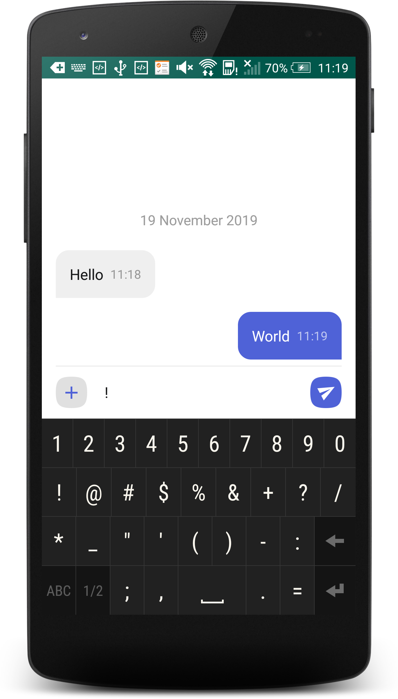

.. _firstapp:

=========
First App
=========

Prerequisites
+++++++++++++

We will assume that you have installed Android Studio, an Android SDK with API
version 29 and Android NDK. If you use a previous API version, the ``create 
activity`` items in these instructions will use AppCompat instead of 
AndroidX [#androidx]_, leading to incompatibilities with the pasted source code.
The Babble node itself is compatible with AppCompat, but converting the sample
to use AppCompat is beyond the scope of this article.

This tutorial is going to assume deployment to a physical Android device. Thus
you will need an Android device (minimum API version 19 [#androiddevice]_) with 
the developer options turned on, debugging enabled, and a suitable USB cable. 
You could use the android emulator, but that is beyond the scope of this
article.

.. [#androidx] You can read more about AndroidX 
   `here <https://android-developers.googleblog.com/2018/05/hello-world-androidx.html>`_. 

.. [#androiddevice] API version 19 is Android 4.4 (KitKat). In May 2019, 3.8% of
   devices were using version 18 or lower. Android 4.4 was released in 2013. 
   Whilst it would be possible to code support for earlier versions, the 
   existing code uses Android features introduced in Android 4.4.

Our First Minimal App
+++++++++++++++++++++

First up, we will create a minimal app to test our environment and prove that we
have loaded the ``babble-android`` library correctly. Fire up Android Studio and
select ``File/New Project``. You are asked to choose a project template.

.. figure:: screenshots/create_new_project.png
   
   Create New Project Screen

Choose **Empty Activity** from the **Phone and Tablet** tab, and click **Next**.

.. figure:: screenshots/new_project_options.png

  New Project Options

The options here should be self-explanatory. We would recommend not using spaces
in the **Package name** or the **Save location**. Do not set the Minimum API 
level below 19. Click **Finish**.

.. figure:: screenshots/empty_android_studio.png 

  Initial Android Studio

Android Studio will open, and after expanding some of the menus it will look 
something like above. 

.. note::

  the screen will change a few seconds after opening when the initial gradle
  scripts complete. The status bar at the bottom of the window should tell you
  this is happening.

Running the App
---------------

Connect your android device to your computer via a USB cable. First we will test
that the Android Debug Bridge (**adb**) can see the device. 

.. code:: bash

    $ adb devices
    List of devices attached
    4JPNU18709118621	device

The command ``adb kill-server`` will reset this connection. 

If you can see a device listed, go back to Android Studio and in the top right
is a target device dropdown. Select your device from the list. 

.. figure:: screenshots/device_selection.png

  Select Device

If you cannot find your device in the list, the 
``Troubleshoot device connections`` option on that menu should help.

Then press that little green triangle to the right of the dropdown device menu.
Gradle builds the app, which is then installed onto the physical Android device
that you selected. The whole process took about 20 seconds on my laptop (feel
free to buy me a quicker one). 

.. list-table::

    * - .. figure:: screenshots/mobile_step_1.png

            First App Screenshot

      - .. figure:: screenshots/default_icon.png

            First App Icon

If you look on the device, you should find the app installed, as on the right
above.

Congratulations, you have an app. Now onto Babble...

Our First Babble App 
++++++++++++++++++++

We will now integrate the ``babble-android`` library into our skeleton app. We 
will use it to generate a key pair -- just to prove that we have a working 
library instance. 

Integrating the Babble-Android Library
--------------------------------------

The library is hosted in **jcenter**. To make it available, we need to amend
some gradle scripts.

.. figure:: screenshots/gradle_scripts.png

  Gradle Scripts

In Android Studio, double click on the Project ``build.gradle`` as highlighted 
in the screenshot above. 
 
We then add the 3 line ``maven`` instruction as below:

.. code::

    allprojects {
        repositories {
            google()
            jcenter()
            maven {
                url 'https://dl.bintray.com/mosaicnetworks/maven'
            }
        }
    } 

Which leaves the entire file looking like this:
 
.. code::

    // Top-level build file where you can add configuration options common to all
    // sub-projects/modules.
    
    buildscript {
        repositories {
            google()
            jcenter()
            
        }
        dependencies {
            classpath 'com.android.tools.build:gradle:3.5.2'
            
            // NOTE: Do not place your application dependencies here; they belong
            // in the individual module build.gradle files
        }
    }
    
    allprojects {
        repositories {
            google()
            jcenter()
            maven {
                url 'https://dl.bintray.com/mosaicnetworks/maven'
            }
        }
    }
  
    task clean(type: Delete) {
        delete rootProject.buildDir
    }
   
Next we need to amend the app ``build.gradle`` (it is below the Project 
``build.gradle`` in the screenshot above). We add an implementation line to the 
bottom dependencies section.

.. code::

    implementation 'io.mosaicnetworks:babble:0.2.1'

This leaves us with this full file:

.. code::

    apply plugin: 'com.android.application'
    
    android {
     compileSdkVersion 29
     buildToolsVersion "29.0.2"
     defaultConfig {
      applicationId "io.mosaicnetworks.myfirstapp"
      minSdkVersion 19
      targetSdkVersion 29
      versionCode 1
      versionName "1.0"
      testInstrumentationRunner "androidx.test.runner.AndroidJUnitRunner"
    }
    buildTypes {
     release {
     minifyEnabled false
     proguardFiles getDefaultProguardFile('proguard-android-optimize.txt'),
         'proguard-rules.pro'
      }
     }
    }
    
    dependencies {
      implementation fileTree(dir: 'libs', include: ['*.jar'])
      implementation 'io.mosaicnetworks:babble:0.2.1'
      implementation 'androidx.appcompat:appcompat:1.1.0'
      implementation 'androidx.constraintlayout:constraintlayout:1.1.3'
      testImplementation 'junit:junit:4.12'
      androidTestImplementation 'androidx.test.ext:junit:1.1.1'
      androidTestImplementation 'androidx.test.espresso:espresso-core:3.2.0'
    }

.. figure:: screenshots/sync_message.png

    Sync Message

.. note:
  
  When you get a message like the above, click the ``Sync Now`` link on the
  right of the message.

Using the Library
-----------------

The library should now be included in the project. So lets use it! Open
``MainActivity.java`` as below:

.. figure:: screenshots/main_activity.png 

  Main Activity

Add the lines below underneath the last import statement. The lines will appear
greyed out, as the import is not yet used. As well as Babble we are importing 
the ``Log`` package to write to the Android logs. 

.. code:: java

    import io.mosaicnetworks.babble.node.KeyPair;
    import android.util.Log;

Add the following lines as the last line of the ``onCreate`` function 

.. code:: java

    KeyPair kp = new KeyPair();
    Log.i("Yippee",kp.privateKey);

This code generates a key pair and writes the private code to the logs. 

Save all the files and run your app. 

.. figure:: screenshots/logcat.png

   LogCat

The app looks exactly as per the previous iteration, so lets take a look under 
the hood. Press logcat, as highlighted in gray in the screenshot above. Then
type ``yippee`` in the search box at the top of that window to filter the logs.
You should have a freshly generated private key in there. 

.. note::

    The project at this stage is available from github from 
    `the stage1 branch of the tutorial repo <https://github.com/mosaicnetworks/babble-android-tutorial/tree/stage1>`_.

The downloadable version of the project has *Mosaic Networks* icons, rather than 
the default Android ones. You can customise the icons using
`Android Studio Image Asset Studio <(https://developer.android.com/studio/write/image-asset-studio>`_. 

Our First Babble Network
++++++++++++++++++++++++

Now we have access to the Babble library from within our app, the next stage is
to start a Babble network. We will start with a single node. But before we can 
start Babble we need to add some UI elements to allow us to interact with our
babble node. 

Currently our application launches the activity ``MainActivity`` which calls the
key pair generation code in it's ``onCreate`` method. 

In the Sample App [#sampleapp]_ that we are working towards, the MainActivity
Screen presents the user with a choice of "**New**" or "**Join**". **New**
starts a new Babble network with your device as the sole peer. **Join** lets you
specify the address of an existing network, pull down the configuration for that
network and request to join it.

As **New** is standalone functionality, and **Join** requires **New** be 
implemented to function, we will implement **New** first.

.. [#sampleapp] The sample app is part of the ``babble-android`` library and is 
   available from the 
   `GitHub repo <https://github.com/mosaicnetworks/babble-android>`_.

Main Activity
-------------

First up we will amend ``MainActivity.java``. replace all of the code with the
following:

.. code:: java

    package io.mosaicnetworks.myfirstapp;
    
    import androidx.appcompat.app.AppCompatActivity;
    
    import android.content.Intent;
    import android.os.Bundle;
    
    import io.mosaicnetworks.babble.node.KeyPair;
    
    
    import io.mosaicnetworks.babble.configure.BaseConfigActivity;
    import io.mosaicnetworks.babble.node.BabbleService;
    
    
    import android.util.Log;
    
    public class MainActivity extends BaseConfigActivity {
        
        @Override
        public BabbleService getBabbleService() {
            return MessagingService.getInstance();
        }
    
        @Override
        public void onJoined(String moniker) {
            // DO nothing for now  
        }
    
        @Override
        public void onStartedNew(String moniker) {
            Intent intent = new Intent(this, ChatActivity.class);
            intent.putExtra("MONIKER", moniker);
            startActivity(intent);
        }
        
    }

We have removed our key generation in the onCreate method. Instead,
``MainActivity`` now extends ``BaseConfigActivity``. The ``BaseConfigActivity``
provides screens to create **New** and to **Join** networks. We just need to
define the callback event handlers for each case. The further processing is
identical in both cases - both result in your Babble node being started and
in a Babble network -- the only difference is the number of nodes. 

If you want more control over the network joining screens, the branches with
0.2.1 suffices in the github repo have a worked version using activities
external to the ``babble-android`` library. 

Add the line below as the first line of the class, we will use this later to 
identify log messages from our app. :

.. code:: java

    public class MainActivity extends AppCompatActivity {
    
        public static final String TAG = "FIRST-BABBLE-APP";

AppState.java
-------------

Copy the source below into place in the same folder as ``MainActivity.java``:

.. code:: java

    package io.mosaicnetworks.myfirstapp;
    
    import com.google.gson.JsonSyntaxException;
    
    import java.nio.charset.StandardCharsets;
    import java.util.ArrayList;
    import java.util.HashMap;
    import java.util.List;
    import java.util.Map;
    
    import io.mosaicnetworks.babble.node.BabbleState;
    
    public class AppState implements BabbleState {
    
        private byte[] mStateHash = new byte[0];
        private final Map<Integer, BabbleTx> mState = new HashMap<>();
        private Integer mNextIndex = 0;
    
        @Override
        public byte[] applyTransactions(byte[][] transactions) {
            for (byte[] rawTx:transactions) {
                String tx = new String(rawTx, StandardCharsets.UTF_8);
    
                BabbleTx babbleTx;
                try {
                    babbleTx = BabbleTx.fromJson(tx);
                } catch (JsonSyntaxException ex) {
                    //skip any malformed transactions
                    continue;
                }
    
                mState.put(mNextIndex, babbleTx);
                mNextIndex++;
            }
    
            updateStateHash();
            return mStateHash;
        }
    
        @Override
        public void reset() {
            mState.clear();
            mNextIndex = 0;
        }
    
        public List<Message> getMessagesFromIndex(Integer index) {
    
            if (index<0) {
                throw new IllegalArgumentException("Index cannot be less than 0");
            }
    
            if (index >= mNextIndex) {
                return new ArrayList<>();
            }
    
            Integer numMessages = mNextIndex - index;
    
            List<Message> messages = new ArrayList<>(numMessages);
    
            for (int i = 0; i < numMessages; i++) {
                messages.add(Message.fromBabbleTx(mState.get(index + i)));
            }
    
            return messages;
        }
    
        private void updateStateHash() {
            //TODO: implement this
        }
    }

BabbleTx.java
-------------

Copy the source below into place in the same folder as ``MainActivity.java``:

.. code:: java

    package io.mosaicnetworks.myfirstapp;
    
    import com.google.gson.Gson;
    import com.google.gson.annotations.SerializedName;
    
    public class BabbleTx implements io.mosaicnetworks.babble.node.BabbleTx {
    
        private final static Gson gson = new Gson();
    
        @SerializedName("from")
        public final String from;
    
        @SerializedName("text")
        public final String text;
    
        public BabbleTx(String from, String text) {
            this.from = from;
            this.text = text;
        }
    
        public static BabbleTx fromJson(String txJson) {
            return gson.fromJson(txJson, BabbleTx.class);
        }
    
        @Override
        public byte[] toBytes() {
            return gson.toJson(this).getBytes();
        }
    }

Message.java
------------

Copy the source below into place in the same folder as ``MainActivity.java``:

.. code:: java

    package io.mosaicnetworks.myfirstapp;
    
    import com.stfalcon.chatkit.commons.models.IMessage;
    import com.stfalcon.chatkit.commons.models.IUser;
    
    import java.util.Date;
    
    public final class Message implements IMessage {
    
        public final static class Author implements IUser {
    
            private final String mName;
    
            public Author(String name) {
                mName = name;
            }
    
            @Override
            public String getId() {
                return mName;
            }
    
            @Override
            public String getName() {
                return mName;
            }
    
            @Override
            public String getAvatar() {
                return null;
            }
        }
    
        private final String mText;
        private final String mAuthor;
        private final Date mDate;
    
        public Message(String text, String author) {
            mText = text;
            mAuthor = author;
            mDate = new Date();
        }
    
        public static Message fromBabbleTx(BabbleTx babbleTx) {
            return new Message(babbleTx.text, babbleTx.from);
        }
    
        public BabbleTx toBabbleTx() {
            return new BabbleTx(mAuthor, mText);
        }
    
        @Override
        public String getId() {
            return mAuthor;
        }
    
        @Override
        public String getText() {
            return mText;
        }
    
        @Override
        public Author getUser() {
            return new Author(mAuthor);
        }
    
        @Override
        public Date getCreatedAt() {
            return mDate;
        }
    
    }

You will note the section below introduces an external dependency: 

.. code:: java

    import com.stfalcon.chatkit.commons.models.IMessage;
    import com.stfalcon.chatkit.commons.models.IUser;

Add the lines below to the app ``build.gradle`` file dependencies section, and
click **Sync Now** on the pop up bar: 

.. code:: java

    implementation 'com.google.code.gson:gson:2.8.5'
    implementation 'com.github.stfalcon:chatkit:0.3.3'

MessagingService.java
---------------------

Copy the source below into place in the same folder as ``MainActivity.java``:

.. code:: java

    package io.mosaicnetworks.myfirstapp;
    
    import io.mosaicnetworks.babble.node.BabbleService;
    
    public final class MessagingService extends BabbleService<AppState> {
    
        private static MessagingService INSTANCE;
    
        public static MessagingService getInstance() {
            if (INSTANCE==null) {
                INSTANCE = new MessagingService();
            }
    
            return INSTANCE;
        }
    
        private MessagingService() {
            super(new AppState());
        }
    }

Chat Activity
-------------

Create a new empty activity, ``ChatActivity``. We will not add any functionality
to it at this point, we just need it to exist as it is referenced in
``MainActivity``. 

Running Babble
--------------

And finally after all of that cut and paste, we have a working instance of 
babble --- albeit with at least one major drawback --- it has no UI and no way
to access it. 

If you start the app through Android Studio, and look at the logcat output
(filtered to just our app), after pressing the New button, entering a Moniker
and pressing the Join button, you should see something like below:

.. figure:: screenshots/logcat_babble.png

  First Babble LogCat

The lines of red text are the lines of interest, stripping out the date and
other prefixes gives something like:

.. code:: 

  msg="Creating InmemStore" prefix=babble
  msg=PARTICIPANTS genesis_peers=1 id=2193277640 moniker=Jon peers=1 prefix=babble
  msg="Start Listening" prefix=babble
  msg="Node belongs to PeerSet" prefix=babble
  msg="FastSync not enabled => Babbling" prefix=babble
  msg=SetHeadAndSeq core.Head= core.Seq=-1 prefix=babble
  msg=runasync gossip=true prefix=babble
  msg="Run loop" prefix=babble state=Babbling
  msg=BABBLING prefix=babble

The key item is the "**state=Babbling**" line, which denotes that Babble is up
and running. 

Some Explanations
+++++++++++++++++

We have just added a lot of code, which is all co-dependent. Now we have a 
babble invocation in place, we can pause to explain what just happened there. 

The configuration of a Babble node is handled by the ``BaseConfigActivity`` 
class from whom ``MainActivity`` inherits. We just need to wire in the 
``ChatActivity`` to take over once we have a Babble network.  

We define a ``MessagingService`` using the ``getBabbleService()`` function. This 
boilerplate class wraps ``BabbleService`` from the babble-android library. 

.. note::

    The project at this stage is available from 
    `the stage2 branch of the tutorial repo <https://github.com/mosaicnetworks/babble-android-tutorial/tree/stage2>`_.

Interacting with Babble
+++++++++++++++++++++++

The next stage is to make Babble usable. To do that we need to work on the 
``ChatActivity`` so it sends and receives messages from Babble. 

First up we need a UI. We are going to use
`ChatKit <https://github.com/stfalcon-studio/ChatKit>`_ rather than reinvent the
wheel. 

activity_chat.xml
-----------------

We can then add the layout to ``res/layout/activity_chat.xml`` 
--- replace all the contents with the code below:

.. code:: xml

    <?xml version="1.0" encoding="utf-8"?>
    <RelativeLayout
        xmlns:android="http://schemas.android.com/apk/res/android"
        xmlns:app="http://schemas.android.com/apk/res-auto"
        xmlns:tools="http://schemas.android.com/tools"
        android:layout_width="match_parent"
        android:layout_height="match_parent"
        android:background="@color/white"
        tools:context=".ChatActivity">
    
        <com.stfalcon.chatkit.messages.MessagesList
            android:id="@+id/messagesList"
            android:layout_width="match_parent"
            android:layout_height="match_parent"
            android:layout_above="@+id/input"/>
    
        <View
            android:layout_width="match_parent"
            android:layout_height="1dp"
            android:layout_above="@+id/input"
            android:layout_marginLeft="16dp"
            android:layout_marginRight="16dp"
            android:background="@color/gray_light"/>
    
        <com.stfalcon.chatkit.messages.MessageInput
            android:id="@+id/input"
            android:layout_width="match_parent"
            android:layout_height="wrap_content"
            android:layout_alignParentBottom="true"
            app:inputHint="@string/hint_enter_a_message"
            app:showAttachmentButton="true"/>
    
    </RelativeLayout>

The layout here is a fairly standard chat layout a message entry section at the
bottom of the screen and a message display above it.

colors.xml
----------

We need to the add the following to ``res/values/colors.xml`` as it is used in 
the code changes above.

.. code:: xml

    <color name="gray_light">#e8e8e8</color>    

ChatActivity.java
-----------------

Replace all of the file ``ChatActivity.java`` with the code below:

.. code:: java

    package io.mosaicnetworks.myfirstapp;
    
    import android.content.Intent;
    import android.os.Bundle;
    import android.widget.Toast;
    
    import androidx.appcompat.app.AppCompatActivity;
    
    import com.stfalcon.chatkit.messages.MessageInput;
    import com.stfalcon.chatkit.messages.MessagesList;
    import com.stfalcon.chatkit.messages.MessagesListAdapter;
    
    import java.util.List;
    
    import io.mosaicnetworks.babble.node.BabbleService;
    import io.mosaicnetworks.babble.node.ServiceObserver;
    
    public class ChatActivity extends AppCompatActivity implements ServiceObserver {
    
        private MessagesListAdapter<Message> mAdapter;
        private String mMoniker;
        private final MessagingService mMessagingService = 
                                                MessagingService.getInstance();
        private Integer mMessageIndex = 0;
    
        @Override
        protected void onCreate(Bundle savedInstanceState) {
            super.onCreate(savedInstanceState);
            setContentView(R.layout.activity_chat);
    
            Intent intent = getIntent();
            mMoniker = intent.getStringExtra("MONIKER");
    
            initialiseAdapter();
            mMessagingService.registerObserver(this);
    
            if (mMessagingService.getState()!= 
                            BabbleService.State.RUNNING_WITH_DISCOVERY) {
                Toast.makeText(this, 
                            "Unable to advertise peers", 
                            Toast.LENGTH_LONG).show();
            }
        }
    
        private void initialiseAdapter() {
            MessagesList mMessagesList = findViewById(R.id.messagesList);
    
            mAdapter = new MessagesListAdapter<>(mMoniker, null);
            mMessagesList.setAdapter(mAdapter);
    
            MessageInput input = findViewById(R.id.input);
    
            input.setInputListener(new MessageInput.InputListener() {
                @Override
                public boolean onSubmit(CharSequence input) {
                    mMessagingService.submitTx(
                        new Message(input.toString(), mMoniker).toBabbleTx());
                    return true;
                }
            });
        }
    
        @Override
        public void stateUpdated() {
    
            final List<Message> newMessages = 
                    mMessagingService.state.getMessagesFromIndex(mMessageIndex);
    
            runOnUiThread(new Runnable() {
                @Override
                public void run() {
                    for (Message message : newMessages ) {
                        mAdapter.addToStart(message, true);
                    }
                }
            });
    
            mMessageIndex = mMessageIndex + newMessages.size();
        }
    
        @Override
        public void onBackPressed() {
            mMessagingService.leave(null);
            super.onBackPressed();
        }
    
        @Override
        protected void onDestroy() {
            mMessagingService.removeObserver(this);
    
            super.onDestroy();
        }
    }

strings.xml
-----------

We need to add the following to ``res/values/strings.xml`` as they are used in
the code changes above.

.. code:: xml

    <string name="hint_enter_a_message">Enter a message</string>

Build, Run and Test 
-------------------

Build your app and run it. You should now be able to start a chat with yourself
and send messages to yourself as below:

.. figure:: screenshots/first_chat.png 
    :width: 80%

    First Chat

.. note::

    The project at this stage is available from
    `the stage3 branch of the tutorial repo <(https://github.com/mosaicnetworks/babble-android-tutorial/tree/stage3>`_.

Joining
+++++++

Thus far, we have been dealing with a single node, which kind of misses the
whole point of using distributed consensus. This section remedies this. We will
add a new button in the ``MainActivity`` to **Join** an existing network. This
will require discovering the network; we will enter the IP address of an
existing node, but more sophisticated service-discovery schemes would be used in
a production environment.

Add the following three lines of code to ``MainActivity.java``:

.. code:: java

    @Override
    public void onJoined(String moniker) {
        Intent intent = new Intent(this, ChatActivity.class);
        intent.putExtra("MONIKER", moniker);
        startActivity(intent);
    }

Build, Run and Test 
-------------------

Build your app and run it on 2 devices. You should now be able to start a chat 
on one and join with the other:

    Stage 4 Phone
  
.. figure:: screenshots/stage_4_tab.png 
    :width: 80%

    Stage 4 Tablet

.. note::

    The project at this stage is available on
    `the stage4 branch of the tutoral repo <https://github.com/mosaicnetworks/babble-android-tutorial/tree/stage4>`_.