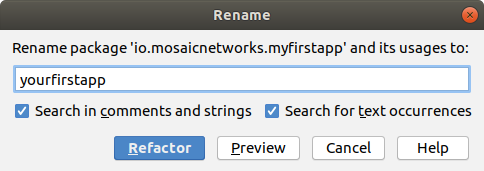
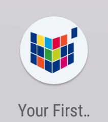

# What next?

This document is intended from follow on from the **My first babble app**
tutorial -- although the impatient may just straight here. 

This is a quick and dirty route map from ``MyFirstApp`` to ``YourFirstApp``. 


## Clone Repo

We are going to take a clean version of ``MyFirstApp``. You could download a zip
from
[github](https://github.com/mosaicnetworks/babble-android-tutorial/tree/stage4)[^stage4]

[^stage4]: [https://github.com/mosaicnetworks/babble-android-tutorial/tree/stage4](https://github.com/mosaicnetworks/babble-android-tutorial/tree/stage4)

From within a suitable working directory, clone the git repo and checkout the
``stage4`` branch. 

```bash
$ git clone https://github.com/mosaicnetworks/babble-android-tutorial.git yourfirstapp
$ cd yourfirstapp
$ git checkout stage4
```

Then de-repo it:

```bash
$ rm -rf .git
```

## Rename App

Open this project in Android Studio. 

Within the Android view, right click on app/java/io.mosaicnetworks.yourfirstapp
and select Refactor > Rename from the menu. 

You then get a warning. Click on ``Rename package``.


Enter your new app name, and click ``Refactor``:




Then click ``Do Refactor``:


If you want to change the FQ name, then (this)[https://stackoverflow.com/questions/18558077/fully-change-package-name-including-company-domain] may help. [^refactor]

[^refactor]: (https://stackoverflow.com/questions/18558077/fully-change-package-name-including-company-domain)[https://stackoverflow.com/questions/18558077/fully-change-package-name-including-company-domain]

For the purposes of this example, I have using a package of ``io.mosaicnetworks.yourfirstapp``

Next update the name of the app in ``res/values/strings.xml`` as shown below:


You should be able to build and run the amended project and see your amended 
name (albeit truncated in this example).

{width=20%}


## Customise

We have an app that handles the creation of a Babble network. Currently it
implements a chat app, but in the next few sections we are going to change that.

First lets strip the chat out. 

In ``Message.java`` amend the following section of code:

```java
import com.stfalcon.chatkit.commons.models.IMessage;
import com.stfalcon.chatkit.commons.models.IUser;

import java.util.Date;

public final class Message implements IMessage {
    public final static class Author implements IUser {
```

to match this section (you can delete -- we have commented it out to make it
clear which lines have been removed):

```java
// import com.stfalcon.chatkit.commons.models.IMessage;
// import com.stfalcon.chatkit.commons.models.IUser;

import java.util.Date;

public final class Message { // implements IMessage {
    public final static class Author { //implements IUser {
```

Additionally comment out every ``@Override`` from that file. We are simply
removing a dependency on the chat library. 

Refactor ``ChatActivity.java``. We will be calling it ``GameActivity.java``.
Remembe to also refactor ``activity_chat.xml`` to ``activity_game.xml``.

In ``GameActivity.java``, delete the following lines of code which implement
the chat interface:

```java
import com.stfalcon.chatkit.messages.MessageInput;
import com.stfalcon.chatkit.messages.MessagesList;
import com.stfalcon.chatkit.messages.MessagesListAdapter;
```

And:

```java
    private MessagesListAdapter<Message> mAdapter;
```

And:

```java
    private void initialiseAdapter() {
        MessagesList mMessagesList = findViewById(R.id.messagesList);

        mAdapter = new MessagesListAdapter<>(mMoniker, null);
        mMessagesList.setAdapter(mAdapter);

        MessageInput input = findViewById(R.id.input);

        input.setInputListener(new MessageInput.InputListener() {
            @Override
            public boolean onSubmit(CharSequence input) {
                mMessagingService.submitTx(new Message(input.toString(), mMoniker).toBabbleTx());
                return true;
            }
        });
    }
```

Comment out:

```java
        initialiseAdapter();
```

And:

```java
        runOnUiThread(new Runnable() {
            @Override
            public void run() {
                for (Message message : newMessages ) {
                    mAdapter.addToStart(message, true);
                }
            }
        });
```        

Finally in the app ``build.gradle`` remove the following line. 

```gradle
    implementation 'com.github.stfalcon:chatkit:0.3.3'
``` 

## Rebuilding

At this point we have an empty app that implements a network, but does nothing
with it. So lets change that:

Firstly lets manage some players. Whilst having a node implies participation, we
are going to create something more formal. We will implement 2 messages:

+ **Join Game**
+ **Leave Game**

Joining and Leaving a game is completely unrelated to the state of the Babble
node. To be clear, leaving a game will not cause Babble to leave the network. 

Open ``activity_game.xml`` formerly known as ``activity_chat.xml``. Delete the
``com.stfalcon.chatkit.messages`` components and the View sandwiched between
them. 

Add the following code to replace the code within the ``RelativeLayout`` that
you just deleted:

```xml


```


Add the following line to ``res/values/colors.xml``:

```xml
    <color name="white">#ffffff</color>
```    


## Developing Your App

To actually develop your app, it may be easiest to develop a pair of wrapper
functions: ``SendMessage`` and ``ProcessMessage``. For the initial development,
you can write a temporary implementation of ``SendMessage`` that invokes
``ProcessMessage`` directly (ideally suitably deferred). This would remove the
dependency on Babble in the initial stages. Rewiring the ``SendMessage`` and
``ProcessMessage`` functions to use Babble instead should then be a
straightforward switch.  